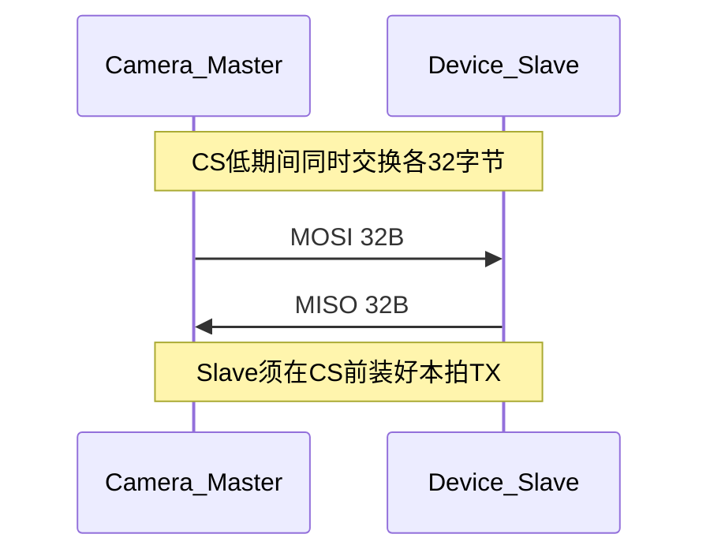

# Camera ↔ MCU SPI 通信协议（双方公共约定）

**版本**：1.9  
**日期**：2026-07-26  
**路径（ESP 仓库）**：`camera/plan/camera-spi-protocol.md`  
**文档性质**：ESP32-S3 Camera 与 TM4C123 小车主控的**唯一公共协议源**  
**适用仓库**：两侧固件均可引用本文；改字典须同步改两端常量头文件  
**实现锚点**：

| 侧 | 常量 / 模块 |
|----|-------------|
| TM4C | `Common/inc/camera_spi.h`、`Common/src/camera_spi.c`（L1～L3 已落地） |
| ESP32 | `camera/main/source/spi_link.h`、`camera_spi_host.c`（与本文 `msg_id` / flags / CRC 一致） |

> **请只按本文实施。** 旧文件名 `camera-spi-role-agreement.md`、`camera_spi_host_protocol_plan.md`，以及 Mode0、ESP MOSI=47/MISO=45、「链路仍 DOWN」等描述一律作废。

---

## 0. 角色与职责（先读）

| 侧 | SPI 角色 | 职责 |
|----|----------|------|
| Camera（ESP32-S3） | **Master** | 约每 20 ms 发起 32B 全双工交换；执行控制；回 `CTRL_ACK`；按优先级上报 DETECT/SERVO/NET_INFO |
| 小车 MCU（TM4C123） | **Slave** | CS 前装好本拍 TX；决策并投递 `CTRL_CMD`；置 `SLAVE_HAS_CMD`；对账 `req_id`；消费上报 |

| 方向 | 谁发 | 内容 |
|------|------|------|
| 控制命令 | **MCU → Camera** | `CTRL_CMD (0x30)` + `SLAVE_HAS_CMD` |
| 控制结果 | **Camera → MCU** | `CTRL_ACK (0x31)`，按 `req_id` 对账 |
| 业务上报 | **Camera → MCU** | `DETECT_RESULT (0x10)`、`SERVO_TELEMETRY (0x20)`、`NET_INFO (0x03)` |
| 总线节奏 | **Camera** | 每约 20 ms 发起一帧全双工交换 |

**一句话**：车（MCU）下命令，相机（ESP）干活并上报。

**首版产品边界**：仅云台 + 检测；不进底盘运动闭环；**不传 JPEG**（图传走 WiFi HTTP）；无 IRQ；无多从机。

**联调顺序（强制）**：HEARTBEAT 稳定 → 再开 DETECT/SERVO → 最后 CTRL。

**当前基线（双方已确认）**：L0～L3 + 真实 DETECT 已通；**SPI `NET_INFO`/`GET_NET_INFO` 已写入协议 v1.9**；TM4C 蓝牙已暴露舵机/检测/图传入口。

**MCU 进度（2026-07-26）**：`camera_spi` + `proto` `0x0040`–`0x0045` + `proto_client` 相机页已合入。  
**ESP 进度**：实现 `NET_INFO(0x03)` 与 `GET_NET_INFO(0x21)` 并与本文对齐。

---

## 1. 接线（已锁定，按信号名对接）

| 信号 | ESP32-S3（Master） | TM4C123（Slave） | 说明 |
|------|--------------------|------------------|------|
| SCK | GPIO **21** | PA2 `SSI0CLK` | 空闲低（CPOL=0） |
| CS（低有效） | GPIO **14** | PA3 `SSI0FSS` | 板无外上拉；**勿热插拔** |
| MOSI（Master→Slave） | GPIO **45** | PA4 `SSI0RX` | |
| MISO（Slave→Master） | GPIO **47** | PA5 `SSI0TX` | |
| GND | 共地 | 共地 | **必须先接** |

**丝印注意**：部分 TM4C 排线丝印上「MOSI/MISO」文字标反。请按上表 **芯片脚功能** 对接（ESP 逻辑 MOSI→PA4，逻辑 MISO→PA5），不要按错误丝印交叉。

电平：**3.3 V**，无需电平转换。

---

## 2. 物理层参数（锁定）

| 参数 | 值 |
|------|-----|
| 角色 | Camera=Master，MCU=Slave |
| 线数 | 仅 4 线，**无 IRQ** |
| SPI Mode | **1**（CPOL=0，CPHA=1）— **禁止 Mode0** |
| 位序 | MSB first |
| 字节序 | 小端（Little-Endian） |
| 帧长 | **固定 32 字节**全双工（同时各收发 32B） |
| 联调时钟 | **1 MHz** |
| 升钟 | 须误码验收；**上限 4 MHz**（不默认承诺 8 MHz） |
| 轮询周期 | Master 约 **20 ms**（50 Hz） |
| 电平 | 3.3 V |

**为何必须 Mode1**：TM4C123 SSI Slave 在整帧 CS 保持低时，Mode0（CPHA=0）下 MISO **往往只移出首字节**，后续为浮空 `0xFF`。双方必须以 Mode1 为准。

### 2.1 CS 时序（Slave 必须满足）

| 阶段 | 要求 |
|------|------|
| CS 拉低前 | Slave **已装载**本拍要发出的 32B TX 缓冲 |
| CS 低 → 首时钟 | Master ≥ 1 µs |
| 传输中 | 连续移出 32×8 bit；全双工；**单次 CS 内传完一整帧**（勿拆成多次 CS） |
| 末位 → CS 拉高 | ≥ 1 µs |
| 两次交换间隔 | CS 高 ≥ 10 µs |

**常见错误**：等收完 MOSI 再组 MISO → 本拍 MISO 为旧数据或 `0xFF`。正确：本拍 MISO = **上一拍已算好的应答**。

---

## 3. 通信保障

### 3.1 保证（Shall）

| ID | 内容 |
|----|------|
| G1 | 每拍恒为 32B；不足 payload 填 0 |
| G2 | 合法帧须 `magic=0xA55A`（线上首两字节 `5A A5`）且 CRC 通过才处理 |
| G3 | CRC-16/CCITT-FALSE 双方一致（见 §4.4 / 附录 B） |
| G4 | 坏帧不执行，仅计数 |
| G5 | Master 持续轮询；短暂误码后可自动恢复 |
| G6 | 控制：MCU 置 `SLAVE_HAS_CMD` + 发 `CTRL_CMD`；Camera 回 `CTRL_ACK`+`req_id` |
| G7 | 检测坐标：原点画面左上，x 右、y 下，单位像素 |
| G8 | 角度：`deg_x100`（180.00° → 18000）；脉宽单位 µs |

### 3.2 不保证

| ID | 内容 | 应对 |
|----|------|------|
| N1 | 控制不保证 exactly-once | 命令幂等 + `req_id` |
| N2 | 检测不保证每拍都发 | MCU 以最新帧为准 |
| N3 | 同帧最多 2 框 | 优先高分 |
| N4 | 不传 JPEG/图像 | 范围外；图传走 WiFi HTTP |
| N5 | 无 IRQ 时 MCU→Camera 可能延迟 2～3 个轮询周期 | 接受轮询拉取 |
| N6 | >1 MHz 不默认零误码 | 升钟前验收 |

### 3.3 链路状态（双方一致）

| 状态 | 条件 |
|------|------|
| LINK_OK | 近 1 s 内 ≥1 帧合法 magic+CRC |
| LINK_DEGRADED | 偶发成功但有连续失败 |
| LINK_DOWN | 连续 ≥10 帧无合法帧（或 MISO 恒 `0xFF`） |

---

## 4. 链路层

### 4.1 交换模型



本拍同时收发；控制处理结果通常在**后续拍**以 `CTRL_ACK` 返回。

### 4.2 帧布局（32 字节）

| 偏移 | 长度 | 字段 | 说明 |
|------|------|------|------|
| 0 | 2 | `magic` | `0xA55A`，小端线上 `5A A5` |
| 2 | 1 | `ver` | `0x01` |
| 3 | 1 | `seq` | 发送方序号，成功后 +1（回绕） |
| 4 | 1 | `msg_id` | 见 §5 |
| 5 | 1 | `flags` | 见 §4.3 |
| 6 | 1 | `len` | payload 有效长度，0～22 |
| 7 | 1 | `rsv` | 写 0 |
| 8 | 22 | `payload` | 余量填 0 |
| 30 | 2 | `crc16` | 小端；覆盖字节 `[0..29]` |

### 4.3 flags

| bit | 名 | 含义 |
|-----|-----|------|
| 0 | `ACK_REQ` | 请求对端后续明确 ACK |
| 1 | `SLAVE_HAS_CMD` | **仅 MISO**：Slave 有 `CTRL_CMD` 待拉取 |
| 2 | `NACK` | 否定语义 |
| 3 | `BUSY` | 忙，请稍后重试 |
| 4..7 | 保留 | 写 0 |

### 4.4 CRC

- 名称：CRC-16/CCITT-FALSE  
- 多项式 `0x1021`，初值 `0xFFFF`，无输入/输出反射，xorout `0x0000`  
- 覆盖：帧字节 `[0..29]`  

**自检（上总线前双方必须通过）**：

| 输入 | CRC |
|------|-----|
| ASCII `"123456789"`（9 字节） | **`0x29B1`** |
| 空 HEARTBEAT 头 30 字节（见下） | **`0x6EB9`**（帧末小端 `B9 6E`） |

```text
偏移 0..29：
5A A5 01 00 01 00 00 00
00 00 00 00 00 00 00 00 00 00 00 00
00 00 00 00 00 00 00 00 00 00
CRC16 = 0x6EB9 → 帧末：B9 6E
```

参考实现见附录 B。

### 4.5 Master 发送优先级（每 20 ms 最多一帧）

1. 有待发 `CTRL_ACK` → 本拍发 `CTRL_ACK`  
2. 上拍 MISO 带 `SLAVE_HAS_CMD` → 本拍发 HEARTBEAT，便于 Slave 吐出 `CTRL_CMD`  
3. CTRL 刚改角强制遥测 → `SERVO_TELEMETRY`  
4. 有待发 `NET_INFO`（`GET_NET_INFO` 或 IP 变化）→ `NET_INFO (0x03)`  
5. 有新检测 → `DETECT_RESULT (0x10)`  
6. 舵机遥测到期（建议 10～20 Hz）→ `SERVO_TELEMETRY (0x20)`  
7. 否则 → `HEARTBEAT (0x01)`  

### 4.6 双方发送策略

**Slave（MCU）**

- 默认：每拍预装 `HEARTBEAT`（`role=2`）或 `STATUS`  
- 有控制意图：在 MISO 帧置 `SLAVE_HAS_CMD`；Master 下一拍拉取时发 `msg_id=0x30`  
- 收到 `CTRL_ACK` 后按 `req_id` 对账；约 **100 ms** 无 ACK 可重发（命令宜幂等）  

**Master（Camera）**

- 链路保活：每拍可发合法 HEARTBEAT（`role=1`）  
- 收到合法 `CTRL_CMD` 后，在后续拍发 `CTRL_ACK (0x31)`（**不是 Slave 发 ACK**）  
- 业务阶段按 §4.5 插发 DETECT / SERVO / NET_INFO  

### 4.7 HEARTBEAT 线上样例（双方对照）

Camera 发出的头 8 字节形如：

```text
5A A5 01 xx 01 00 08 00
```

| 偏移 | 值 | 含义 |
|------|-----|------|
| 0..1 | `5A A5` | magic |
| 2 | `01` | ver |
| 3 | `xx` | seq 自增 |
| 4 | `01` | HEARTBEAT |
| 5 | `00` | flags |
| 6 | `08` | len=8 |
| 7 | `00` | rsv |
| 8..11 | u32 LE | `uptime_ms` |
| 12 | `01` | `role`=Camera Master |
| 13 | `01` | `proto_ver` |
| 14..15 | u16 LE | `err_flags` |
| 30..31 | CRC16 LE | |

MCU 正常应答时，头为 `5A A5 ...`，payload `role=2`。

---

## 5. 应用消息字典

### 5.1 总表

| msg_id | 名称 | 方向 | 说明 |
|--------|------|------|------|
| `0x01` | HEARTBEAT | 双向 | 存活（当前双方已用） |
| `0x02` | STATUS | 双向 | 状态与链路计数 |
| `0x03` | NET_INFO | Camera→MCU | 图传入口（IPv4/端口/path_id） |
| `0x10` | DETECT_RESULT | Camera→MCU | 检测框（最多 2） |
| `0x20` | SERVO_TELEMETRY | Camera→MCU | 云台角度/脉宽/限位 |
| `0x30` | CTRL_CMD | MCU→Camera | 控制 |
| `0x31` | CTRL_ACK | Camera→MCU | 控制结果 |

### 5.2 HEARTBEAT `0x01`（len=8）

| 偏移 | 类型 | 字段 |
|------|------|------|
| 0 | u32 | `uptime_ms` |
| 4 | u8 | `role`：1=Camera Master，2=MCU Slave |
| 5 | u8 | `proto_ver` |
| 6 | u16 | `err_flags`（见 §5.7） |

### 5.3 STATUS `0x02`（len=12）

| 偏移 | 类型 | 字段 |
|------|------|------|
| 0 | u32 | `device_flags` |
| 4 | u16 | `crc_err_count` |
| 6 | u16 | `magic_err_count` |
| 8 | u16 | `last_nack_code` |
| 10 | u16 | `rsv` |

### 5.3a NET_INFO `0x03`（len=12）

| 偏移 | 类型 | 字段 |
|------|------|------|
| 0 | u32 | `ipv4`：`a.b.c.d` → `a\|(b<<8)\|(c<<16)\|(d<<24)`；无效时 0 |
| 4 | u16 | `http_port`（通常 80） |
| 6 | u8 | `wifi_mode`：0=OFF，1=STA，2=SoftAP |
| 7 | u8 | `flags`：bit0=`HAS_IP`，bit1=`HTTP_UP`，bit2=`STREAM_READY` |
| 8 | u8 | `stream_path_id`：0=`/api/camera/stream.mjpg`（枚举，不传字符串） |
| 9 | u8 | `rsv` |
| 10 | u16 | `rsv2` |

MCU 查询：CTRL `GET_NET_INFO (0x21)` 无参数；Camera ACK 后按优先级插发 `NET_INFO`。IP 变化亦可主动上报。

上位机组 URL：

```text
http://{a}.{b}.{c}.{d}:{http_port}/api/camera/stream.mjpg
```

（`stream_path_id=0`）

### 5.4 DETECT_RESULT `0x10`

坐标：原点左上，x 右、y 下，单位像素。  
首版 box 无独立 `h` 字段；中心按方形近似：`cx = x + w/2`，`cy = y + w/2`（整数截断）。  
建议 `len = 6 + 8×count`（count=0/1/2 → len=6/14/22）。

| 偏移 | 类型 | 字段 |
|------|------|------|
| 0 | u16 | `frame_w` |
| 2 | u16 | `frame_h` |
| 4 | u8 | `count`（0～2） |
| 5 | u8 | `best_index`（最高分下标；无框=`0xFF`） |
| 6 | 8B | box[0] |
| 14 | 8B | box[1] |

box（8B）：`u16 x, y, w` + `u8 score_u8` + `u8 class_id`  
`score_u8` = 置信度×255 钳位；钢珠 `class_id=0`。

### 5.5 SERVO_TELEMETRY `0x20`（len=16）

| 偏移 | 类型 | 字段 |
|------|------|------|
| 0 | i16 | `pan_deg_x100` |
| 2 | i16 | `tilt_deg_x100` |
| 4 | u16 | `pan_pulse_us` |
| 6 | u16 | `tilt_pulse_us` |
| 8 | i16 | `pan_min_x100` |
| 10 | i16 | `pan_max_x100` |
| 12 | i16 | `tilt_min_x100` |
| 14 | i16 | `tilt_max_x100` |

云台语义：

- 通道：`0`=Pan，`1`=Tilt  
- 角度 0～360° ↔ 脉宽约 500～2500 µs，中位约 180°=1500 µs  
- 默认软限位示例：Pan 0～360，Tilt 60～300  

### 5.6 CTRL_CMD `0x30` / CTRL_ACK `0x31`

CTRL_CMD 头：

| 偏移 | 类型 | 字段 |
|------|------|------|
| 0 | u8 | `sub_cmd` |
| 1 | u8 | `req_id` |
| 2 | u8 | `argc` |
| 3 | u8 | `rsv` |
| 4 | … | 参数 |

| sub_cmd | 名 | 参数 | 首版约定 |
|---------|-----|------|----------|
| `0x01` | DETECT_ENABLE | u8 on（0/1） | Camera **需支持** |
| `0x02` | FOLLOW_ENABLE | u8 on（0/1） | 可先 `UNSUPPORTED` |
| `0x10` | SERVO_SET_ANGLE | u8 ch + i16 deg_x100 | Camera **需支持** |
| `0x11` | SERVO_NUDGE | u8 ch + i16 delta_x100 | Camera **需支持** |
| `0x12` | SERVO_CENTER | 无参数 | Camera **需支持** |
| `0x13` | SERVO_SET_LIMITS | 4×i16（pan_min/max, tilt_min/max，×100） | 建议支持 |
| `0x14` | SERVO_RESET_LIMITS | 无参数 | 建议支持 |
| `0x20` | SET_STREAM_MODE | u8 mode | 可先 `UNSUPPORTED` |
| `0x21` | GET_NET_INFO | 无参数 | Camera **需支持**：随后发 `NET_INFO` |

CTRL_ACK：

| 偏移 | 类型 | 字段 |
|------|------|------|
| 0 | u8 | `sub_cmd` 回显 |
| 1 | u8 | `req_id` 回显 |
| 2 | u8 | `result`：0=OK，1=BAD_PARAM，2=BUSY，3=UNSUPPORTED，4=FAILED |
| 3 | u8 | `rsv` |
| 4 | u32 | `detail` 可选（`GET_NET_INFO` 时可带当前 `ipv4`） |

### 5.7 标志位

**err_flags（u16）**：bit0 `LINK_CRC_STORM`，bit1 `SLAVE_NOT_RESPONDING`，bit2 `DETECT_FAULT`，bit3 `SERVO_FAULT`，bit4 `CTRL_REJECTED_RECENT`。

**device_flags（u32，Camera 常用）**：bit0 `DETECT_READY`，bit1 `DETECT_RUNNING`，bit2 `FOLLOW_ENABLED`，bit3 `SERVO_READY`，bit4 `WIFI_UP`，bit5 `OTA_BUSY`。

---

## 6. 错误处理

| 场景 | 行为 |
|------|------|
| magic / CRC 错误 | 丢弃，不执行；计数 +1 |
| `len` > 22 | 丢弃 |
| 未知 msg_id / sub_cmd | 丢弃或 ACK=`UNSUPPORTED` |
| 连续无合法帧 | LINK_DOWN；**仅发 HEARTBEAT 探测**，禁止 L2；连续 ≥8 帧合法 HB(role=2) 后再开 L2 |
| CTRL 无 ACK | MCU 超时重发 |
| Camera 忙（如 OTA） | 置 `BUSY`；CTRL 回 `result=BUSY` |

---

## 7. 双方开发里程碑

| 里程碑 | Camera（ESP Master） | MCU（TM4C Slave） | 状态 |
|--------|----------------------|-------------------|------|
| L0 通路 | 发合法帧 / 固定图案可辨 | Mode1 Slave 装缓冲；可辨 MOSI | **双方已通** |
| L1 心跳 | 发 `HEARTBEAT role=1`；认 `role=2` | 发 `HEARTBEAT role=2`；认 `role=1` | **双方已通** |
| L2 上报 | 按 §4.5 发 `0x10` / `0x20` / `0x03` | 解析缓存 + 周期日志 | **DETECT 真实已通；NET_INFO ESP 已实现** |
| L3 控制 | 解析 `0x30`，执行，回 `0x31` | `SLAVE_HAS_CMD`→`0x30`→对账 `0x31`（100 ms 重发×5） | **双方已通；含 GET_NET_INFO** |

**双方保持**：

1. Mode1、1 MHz、32B、CRC 自检通过  
2. Slave：CS 前预装下一拍 TX；本拍 MISO = 上一拍结果  
3. HEARTBEAT：`role` 分别为 1 / 2，`uptime_ms` 递增  
4. 线测填充（如 `A5×32`）仅用于 L0；L1 起用正式心跳  
5. 改 `msg_id` / `sub_cmd` / flags / 布局时，**同步更新本文与两端头文件**

---

## 8. 验收阶梯

| 阶梯 | 通过标准 | 状态 |
|------|----------|------|
| A. 参数一致 | 本文 §1～§2 + CRC 向量双方算出 | **已对齐** |
| B. 接线 | 按 §1；共地；不热插拔 | **已对齐** |
| C. L0/L1 | 1 MHz：双方 `link=OK`，`rx_ok` 增，`peer_role` 互认 | **已通过** |
| D. 稳定 | ≥1 min，CRC 错率 &lt; 0.1%（或双方约定） | 请双方确认 |
| E. L2 业务 | MCU 正确识别 DETECT/SERVO/NET_INFO | **DETECT 真实已通过；NET_INFO 待联调** |
| F. L3 控制 | `SERVO_CENTER` / `DETECT_ENABLE` / `GET_NET_INFO` 得 ACK=OK | **center 已通过；GET_NET_INFO 待联调** |
| G. 压力 | 50 Hz×10 min；断线恢复 | 后续 |

### 现场检查

- [ ] GND 已接，3.3 V  
- [ ] SCK/MOSI/MISO/CS 按 §1（ESP：21 / **45** / **47** / 14 ↔ TM4C：PA2 / PA4 / PA5 / PA3）  
- [ ] **Mode1**、MSB、32B、同一 CRC、1 MHz、约 20 ms  
- [ ] 双方 CRC 自检：`123456789→0x29B1`  
- [ ] MCU UART7 @ 115200：`camera_spi:` / `link=OK`  
- [ ] ESP：`spi1 init ok ... MOSI=45 MISO=47 ... Mode1`；`link=OK`，`peer_role=2`  

功能抽检：

| 编号 | 操作 | 期望 |
|------|------|------|
| T1 | 仅心跳 | 双端 uptime 增加，CRC 正确 |
| T2 | 有检测目标 | MCU 收到 `0x10`，坐标合理 |
| T3 | 云台运动 | MCU 收到 `0x20` 角度变化 |
| T4 | MCU 发回中 | ACK=OK，云台回中 |
| T5 | 故意错 CRC | 不执行命令，计数增加 |
| T6 | 断 MISO 再恢复 | 先 LINK_DOWN，恢复后自动 LINK_OK |
| T7 | `GET_NET_INFO` | ACK=OK；随后 `NET_INFO`；URL 可开 MJPEG |

---

## 9. 双方确认表

| # | 项 | 值 | 状态 |
|---|-----|-----|------|
| 1 | Camera=Master，MCU=Slave | 是 | 锁定 |
| 2 | 仅 4 线，无 IRQ | 是 | 锁定 |
| 3 | SPI Mode1 | CPOL=0,CPHA=1 | **锁定（实测）** |
| 4–8 | MSB / 小端 / 32B / magic / CRC | 本文 | 锁定 |
| 9–10 | 1 MHz 联调；升钟 ≤4 MHz 验收 | 是 | 锁定 |
| 11 | 20 ms 轮询 | 是 | 锁定 |
| 12–13 | DETECT≤2；`deg_x100`；box 无独立 `h` | 是 | 锁定 |
| 14 | CTRL 表 | Follow/Stream 可 UNSUPPORTED；`GET_NET_INFO` 需支持 | 锁定 |
| 15–16 | `SLAVE_HAS_CMD`；保障/非保障 | 是 | 锁定 |
| 17 | 脚位 | ESP 21/45/47/14 ↔ PA2/PA4/PA5/PA3 | **锁定** |
| 18 | 图传 | SPI 只传 `NET_INFO`；HTTP `/api/camera/stream.mjpg` | **锁定** |

**共同结论**：链路与控制闭环已通；**真实钢珠 DETECT 已通**。后续：`NET_INFO` 联调、真实舵机动作/遥测、稳定性与压力验收。

| 侧 | 日期 | 状态 |
|----|------|------|
| Camera（ESP32-S3） | 2026-07-26 | L0～L3 + 真实 DETECT；**NET_INFO/GET_NET_INFO 已实现** |
| MCU（TM4C123） | 2026-07-26 | L0～L3 已通；NET_INFO 消费待联调 |

---

## 附录 A — 双方日志对照

| 侧 | 日志 / 现象 | 含义 |
|----|-------------|------|
| ESP | `spi1 init ok SCK=21 MOSI=45 MISO=47 CS=14 1000000Hz Mode1...` | Master 已起 |
| ESP | `spi1: TX 5A A5 01 .. 01 00 08 00` | 发出 HEARTBEAT 头 |
| ESP | `spi1: RX 5A A5 01 ..` | 收到 MCU 合法帧头 |
| ESP | `spi1: link=OK ... peer_role=2` | L1 正常 |
| ESP | `spi1: DETECT tx n=...` / `SERVO tx pan=...` | L2 业务上报 |
| ESP | `spi1: NET_INFO tx ip=... port=...` | 图传入口上报 |
| ESP | `spi1: CTRL_CMD rx` / `CTRL_ACK tx` | L3 控制对账 |
| ESP | `spi1: link=DOWN` | 连续多帧无合法应答 |
| ESP | `MISO stuck LOW` / `float/idle HIGH` | 查线 / CS / MCU 是否运行 |
| MCU | UART7：`cam_spi link=OK` / `peer_role=1` | L1 正常 |
| MCU | `cam_spi DETECT n=...` / `cam_spi SERVO pan=...` | L2 已收到业务帧 |
| MCU | `cam_spi NET_INFO ...` | 已收到图传入口 |
| MCU | `cam_spi CTRL_CMD queue` / `CTRL_ACK ok` | L3 对账成功 |
| MCU | 厂测 UART7：`cam status` / `cam detect` / `cam center` | L2/L3 手工联调 |
| MCU | `cam_spi: RX=00 MOSI open?` | 查 ESP45(MOSI)↔PA4 / 线序 |

---

## 附录 B — CRC 参考实现

```c
#include <stdint.h>
#include <stddef.h>

/* CRC-16/CCITT-FALSE: poly 0x1021, init 0xFFFF, no refin/refout, xorout 0 */
uint16_t spi_link_crc16(const uint8_t *data, size_t len)
{
    uint16_t crc = 0xFFFFU;
    size_t i;
    int b;

    for (i = 0; i < len; i++) {
        crc ^= (uint16_t)data[i] << 8;
        for (b = 0; b < 8; b++) {
            if (crc & 0x8000U) {
                crc = (uint16_t)((crc << 1) ^ 0x1021U);
            } else {
                crc = (uint16_t)(crc << 1);
            }
        }
    }
    return crc;
}

/* 自检：spi_link_crc16("123456789", 9) == 0x29B1 */
/* 帧向量：见 §4.4，前 30 字节 CRC == 0x6EB9 */
```

---

## 附录 C — 相对旧描述的变更（避免踩坑）

| 项 | 旧描述（作废） | 本文 |
|----|----------------|------|
| 文档名 | `camera_spi_host_protocol_plan.md` / `camera-spi-role-agreement.md` | **`camera-spi-protocol.md`**（双方公共） |
| SPI Mode | Mode0 | **Mode1** |
| ESP MOSI / MISO | 47 / 45 | **45 / 47** |
| 升钟上限 | 有的稿写 8 MHz | **≤4 MHz 且须验收** |
| CTRL_ACK 发送方 | 误写在 Slave 策略里 | **Camera（Master）发送** |
| L1 状态 | 部分旧说明写仍 DOWN | **已通，进入 L2/L3** |
| 图传 | 误以为走 SPI | **SPI 仅 NET_INFO；HTTP MJPEG** |

---

## 10. 联调后续

### 10.1 NET_INFO / 图传入口

1. MCU 发 `GET_NET_INFO (0x21)`  
2. ESP：`CTRL_ACK`（`detail` 可含 ipv4）→ 随后 `NET_INFO (0x03)`，`stream_path_id=0`  
3. 上位机打开：`http://IP:port/api/camera/stream.mjpg`  

### 10.2 MCU 现场确认（厂测 UART7）

```text
cam detect
cam status
```

### 10.3 建议再抽检 CTRL

```text
cam detect_on
cam detect_off
cam angle 0 18000
cam nudge 1 -500
cam center
cam status
```

---

## 变更记录

| 日期 | 版本 | 说明 |
|------|------|------|
| 2026-07-25 | 1.0～1.2 | 草案、Mode1 联调确认 |
| 2026-07-26 | 1.3 | 与可通信固件对齐（Mode1、MOSI=45/MISO=47）；修正 CTRL_ACK 归属；明确 L1 已通 |
| 2026-07-26 | 1.4 | 改为 **ESP↔MCU 双方公共协议**；文件名 `camera-spi-protocol.md`；里程碑与确认表双边化 |
| 2026-07-26 | 1.5 | MCU 落地 L2/L3；新增 §10 ESP 任务清单 |
| 2026-07-26 | 1.6 | L2 双方联调通过；§10 改为 L3 联调焦点 |
| 2026-07-26 | 1.7 | L3 双方通过（`cam center` → ack_ok=1）；§10 改为联调后续 |
| 2026-07-26 | 1.8 | ESP 真实钢珠 DETECT 已通；文档同步 MCU 验收要点 |
| 2026-07-26 | **1.9** | 定稿 `NET_INFO(0x03)` / `GET_NET_INFO(0x21)`；path_id=0→`/api/camera/stream.mjpg`；ESP 实现落地 |
