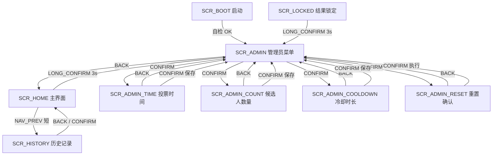
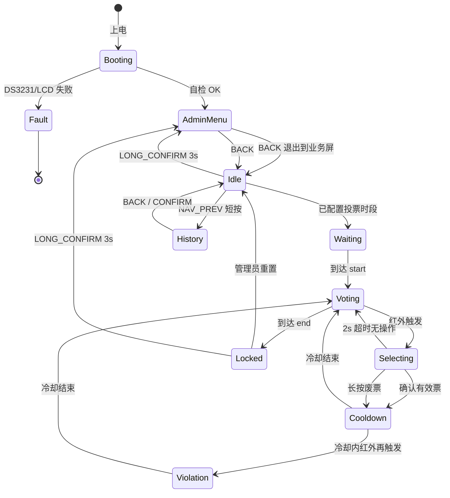

# Ballot Guard · LCD 菜单控制逻辑（评审稿）

**版本**：v0.2（评审用）  
**依据**：[`tmp/产品使用逻辑 + GPIO 硬连接表.md`](../tmp/产品使用逻辑%20+%20GPIO%20硬连接表.md)  
**工程**：`ballot_guard/`（ESP32-S3 + ST7789 240×135 横屏 + 6 物理按键）  
**日期**：2026-06-21  

> 本文**仅描述 LCD 菜单与界面控制逻辑**：各界面长什么样、按键如何驱动、主界面与操作流程、异常处理、核心状态机。  
> GPIO 引脚分配见 [`ballot_guard_product_usage.md`](./ballot_guard_product_usage.md)。像素级布局细节见 `tmp/ballot_guard_LCD菜单UI设计.md`。  
> **v0.2 变更**：上电默认管理员页；IP 地址仅管理员页可见；配置与历史数据统一存入 NVS 专用分区；候选人英文名由网页后台维护并持久化至片内 Flash。

---

## 1. 设计原则

1. **单一状态源**：系统状态机驱动 LCD 画面、RGB 灯效、网页 `phase` 字段三者一致。
2. **分工管理**：投票时段、候选人数量、冷却时长、重置票数等在 **LCD 管理员菜单** 操作；**候选人英文名**在 **网页后台** 添加与编辑（见 §7.7）。
3. **上电即管理**：自检完成后 LCD **默认进入管理员菜单**（`SCR_ADMIN`），便于首次配网与参数设定；IP 地址**仅在此页面展示**，业务屏不显示。
4. **持久化集中**：配置参数、候选人姓名、历史记录、当前票数等统一写入 NVS **专用命名空间**（见 §9.3），断电不丢失。
5. **逻辑与硬件解耦**：交互统一用逻辑动作描述，再映射到 6 个物理按键。
6. **现场可读**：投票者 1 米内可辨认状态与候选人；LCD 显示**英文姓名**（≤20 字符），字号偏大、对比度高。

---

## 2. 逻辑动作与按键映射

### 2.1 逻辑动作定义

| 逻辑动作 | 含义 | 典型场景 |
|:---|:---|:---|
| `NAV_PREV` | 焦点上移 / 数值减小 / 上一条 | 菜单上一项、候选人上一个、历史上翻 |
| `NAV_NEXT` | 焦点下移 / 数值增大 / 下一条 | 菜单下一项、候选人下一个、历史下翻 |
| `CONFIRM` | 确认 / 进入子项 / 保存 / 有效票 | 菜单确认、选人后计票 |
| `BACK` | 返回上级 / 取消 | 退出菜单、取消重置 |
| `LONG_CONFIRM` | 长按确认 ≥ 3 s | 业务屏返回管理员菜单 |
| `LONG_BACK` | 长按返回 ≥ 2 s | 选人界面登记废票（**非菜单**） |

### 2.2 目标 6 键映射

| 物理按键 | GPIO | 短按 | 长按 |
|:---|:---|:---|:---|
| 上 | 8 | `NAV_PREV` | — |
| 下 | 15 | `NAV_NEXT` | — |
| 左 | 16 | （预留，菜单横向导航） | — |
| 右 | 17 | （预留） | — |
| 确认 | 18 | `CONFIRM` | `LONG_CONFIRM`（3 s 从业务屏回管理员菜单） |
| 返回 | 21 | `BACK` | `LONG_BACK`（2 s 登记废票，仅选人屏） |

菜单内**仅使用** `NAV_PREV` / `NAV_NEXT` / `CONFIRM` / `BACK`；`LONG_BACK` 只在投票选人流程中生效。

---

## 3. 画面清单

| 画面 ID | 名称 | 类型 | 说明 |
|:---|:---|:---|:---|
| `SCR_BOOT` | 启动 | 业务 | 上电自检 |
| `SCR_FAULT` | 故障 | 业务 | 外设初始化失败 |
| `SCR_HOME` | 主界面 | 业务 | 待机 / 待开启看板 |
| `SCR_VOTING` | 投票等待 | 业务 | 投票时段内，等待红外触发 |
| `SCR_SELECT` | 选人 | 业务 | 红外触发后选择候选人 |
| `SCR_COOLDOWN` | 冷却 | 业务 | 计票后防重复锁定 |
| `SCR_VIOLATION` | 违规 | 业务 | 冷却期内重复靠近 |
| `SCR_LOCKED` | 结果锁定 | 业务 | 投票结束 |
| `SCR_HISTORY` | 历史记录 | 业务 | 最近 10 次投票摘要 |
| `SCR_ADMIN` | 管理员菜单 | **菜单** | 四项配置入口 |
| `SCR_ADMIN_TIME` | 投票时间 | **菜单** | 开始 / 结束时间 |
| `SCR_ADMIN_COUNT` | 候选人数量 | **菜单** | 2 ~ 6 人 |
| `SCR_ADMIN_COOLDOWN` | 冷却时长 | **菜单** | 3 ~ 10 秒 |
| `SCR_ADMIN_RESET` | 重置确认 | **菜单** | 二次确认清空票数 |

### 3.1 公共布局（240 × 135 横屏）

所有业务页与菜单页采用统一三区结构：

```
┌─ TITLE_BAR ───────────────────────── 22px  时间 / 标题 / 状态徽章
├─ BODY ─────────────────────────────── 92px  各屏主体内容
└─ FOOT_HINT ────────────────────────── 16px  操作提示（灰字，不出现具体键名）
```

- 背景色 `#0D1218`；焦点行左 3px 蓝色边 + `#243044` 底
- 危险项（重置）焦点时红色强调
- Toast：居中绿底「已保存」，显示 1 s
- 长按进度环：业务屏右下角，直径 32 px，`LONG_CONFIRM` 按住时 0→100%，满 3 s 回管理员菜单（上电后已在管理员页，无需此操作）

---

## 4. 主界面 `SCR_HOME`

### 4.1 界面样式

**触发**：自检完成；处于非投票时段、待开启倒计时、或投票已结束未重置。  
**RGB**：绿色常亮。  
**顶栏徽章**：`待机` / `待开启`（有倒计时时）。

```
┌─ 14:32:05 ─────── 选票看板 ────── [待开启] ─┐
│ Candidate           Votes                    │
│ ▶ Alice              12                      │  ← 焦点行（非投票时仅浏览）
│   Bob                 8                      │
│   Carol               5                      │
│ ─────────────────────────────────────────── │
│ Valid 25  Spoiled 2  Total 27                │
│ Starts in 12m 08s                            │  ← Waiting 时显示；Idle 无时段则隐藏
├─ Prev record · Long press for settings ─────┤
└────────────────────────────────────────────┘
```

- 候选人 2 ~ 6 行，行高 22 px；姓名取自 NVS（英文，≤20 字符，网页后台维护）；超出时 `NAV_NEXT` 滚动浏览
- 右侧实时显示各候选人得票与汇总
- **不显示 IP 地址**（IP 仅在 `SCR_ADMIN` 可见）

### 4.2 控制逻辑

| 逻辑动作 | 行为 |
|:---|:---|
| `NAV_PREV` | 进入 `SCR_HISTORY` |
| `NAV_NEXT` | 候选人列表向下滚动（**不改变票数**） |
| `LONG_CONFIRM` | 按住 3 s，显示进度环 → 进入 `SCR_ADMIN` |
| `BACK` | 无效果 |
| `CONFIRM`（短按） | 无效果 |

### 4.3 进入 / 退出管理员菜单

| 场景 | 行为 |
|:---|:---|
| **上电自检完成** | 自动进入 `SCR_ADMIN`（默认管理员页） |
| 管理员菜单 `BACK` | 退出 → 按当前 phase 进入对应业务屏（通常 `SCR_HOME`） |
| 业务屏 `LONG_CONFIRM` 3 s | 返回 `SCR_ADMIN` |

| 当前业务屏 | 是否允许 `LONG_CONFIRM` 回管理员 |
|:---|:---|
| `SCR_HOME`（待机 / 待开启） | ✅ 允许 |
| `SCR_LOCKED`（投票已结束） | ✅ 允许 |
| `SCR_VOTING` / `SCR_SELECT` / `SCR_COOLDOWN` / `SCR_VIOLATION` | ❌ **不允许**（防误触改配置） |

进入管理员菜单时：蜂鸣器短鸣 1 声；RGB **保持进入前业务色**（菜单不单独改灯色）。

---

## 5. 投票流程界面

### 5.1 投票等待 `SCR_VOTING`

**触发**：当前时间 ∈ [开始, 结束)。  
**RGB**：蓝色慢闪 1 Hz。进入时蜂鸣器短鸣 2 声。

```
┌─ 14:35:00 ─── [投票进行中] ─── 剩余 4:22 ─┐
│ 请靠近感应区，准备投票                      │
│                                            │
│ 有效 25   废票 2                           │
├─ 靠近感应区 · 等待选人 ────────────────────┤
└────────────────────────────────────────────┘
```

| 逻辑动作 | 行为 |
|:---|:---|
| 全部按键 | **无用户操作**（等待红外触发） |
| 红外下降沿 | 自动切换 → `SCR_SELECT` |

顶栏右侧显示距结束剩余时间（分:秒）。红外未触发时不显示候选人列表，避免误读。

---

### 5.2 选人 `SCR_SELECT`

**触发**：GPIO38 红外下降沿。  
**RGB**：蓝色快闪 2 Hz，持续约 2 s。

```
┌─ 14:35:12 ──── [Select Candidate] ──────────┐
│                                            │
│   ┌──────────────────────────────┐        │
│   │  ▶  Bob                      │        │  accent 底 + 白字
│   └──────────────────────────────┘        │
│      Alice   Carol   (cycle)              │
├─ Confirm valid · Long back spoiled ────────┤
└────────────────────────────────────────────┘
```

| 逻辑动作 | 行为 |
|:---|:---|
| `NAV_PREV` / `NAV_NEXT` | 环形切换候选人（2 ~ 6 人） |
| `CONFIRM`（短按） | 当前候选人有效票 +1 → RGB 绿色快闪 2 次 → `SCR_COOLDOWN` |
| `LONG_BACK`（2 s） | 废票 +1 → RGB 红色快闪 3 次 → `SCR_COOLDOWN` |
| `BACK`（短按） | 无效果 |
| 2 s 无操作 | 自动回到 `SCR_VOTING`（保留焦点索引） |

---

### 5.3 冷却 `SCR_COOLDOWN`

**触发**：成功登记有效票或废票后。  
**时长**：默认 5 s，管理员可设 3 ~ 10 s。  
**顶栏徽章**：`请稍候` + 秒数。

```
┌─ 14:35:15 ──────── [请稍候] ───────────────┐
│                                            │
│          冷却中  03                         │  ← 大号倒计时
│                                            │
│   Registered: Bob +1 valid                 │  ← 上一笔操作摘要（英文姓名）
│   请勿重复靠近感应区                        │
├─ 请等待冷却结束 ────────────────────────────┤
└────────────────────────────────────────────┘
```

| 事件 | 行为 |
|:---|:---|
| 倒计时归零 | → `SCR_VOTING` |
| 冷却期内红外再触发 | → `SCR_VIOLATION` |
| 按键 | 全部忽略 |

---

### 5.4 违规 `SCR_VIOLATION`

**触发**：冷却期间红外再次触发。  
**RGB**：红色急促闪烁 + 蜂鸣器连续报警。  
**持续**：至冷却结束或至少 3 s（取较长）。

```
┌─ 14:35:17 ──────── [违规重复] ─────────────┐
│                                            │
│   ⚠ 请勿重复投票                            │
│                                            │
│   请等待  02  秒                            │
├─ 冷却结束前请勿靠近 ────────────────────────┤
└────────────────────────────────────────────┘
```

| 事件 | 行为 |
|:---|:---|
| 冷却结束 | → `SCR_VOTING` |
| 按键 | 全部忽略 |

---

### 5.5 结果锁定 `SCR_LOCKED`

**触发**：当前时间 ≥ 结束时间。  
**RGB**：绿色常亮；蜂鸣器长鸣 3 声。

```
┌─ 16:00:00 ──── [Voting Locked] ─────────────┐
│ Final Results                               │
│ Alice ████████████  12                      │
│ Bob   ████████      8                       │
│ Carol █████         5                       │
│ ─────────────────────────────────────────── │
│ Valid 25  Spoiled 2  Total 27               │
├─ Voting ended · Long press for settings ────┤
└────────────────────────────────────────────┘
```

| 逻辑动作 | 行为 |
|:---|:---|
| `LONG_CONFIRM` | 进入 `SCR_ADMIN`（可重置本次数据） |
| 其他按键 | 无效果（或预留浏览，不改变数据） |

柱状图与网页看板数据一致，1 s 内同步。**不显示 IP 地址**。

---

## 6. 历史记录 `SCR_HISTORY`

**入口**：主界面 `NAV_PREV`（短按上键）。  
**容量**：最近 10 条，含时间戳与汇总；数据从 NVS 历史分区读取（见 §9.3）。

```
┌─ 14:32:05 ──── History (3/10) ──────────────┐
│ 2026-06-19 16:00  Ended                      │  ← 焦点行
│ V25 S2  Alice12 Bob8 Carol5                  │
│ ─────────────────────────────────────────── │
│ 2026-06-18 16:00  Ended                      │
│ V30 S1  ...                                  │
├─ Prev · Next · Back ─────────────────────────┤
└────────────────────────────────────────────┘
```

| 逻辑动作 | 行为 |
|:---|:---|
| `NAV_PREV` | 上一条记录 |
| `NAV_NEXT` | 下一条记录 |
| `BACK` / `CONFIRM` | → `SCR_HOME` |

---

## 7. 管理员菜单

### 7.1 导航树



**导航栈建议**：`ui_nav_stack: [ SCR_HOME, SCR_ADMIN, SCR_ADMIN_TIME ]`；`BACK` 弹栈并重绘栈顶。

---

### 7.2 管理员菜单根 `SCR_ADMIN`

**上电默认页**：自检完成后直接进入本屏。  
**IP 地址**：**全系统唯一展示 IP 的位置**（SoftAP 固定 `192.168.4.1`，STA 模式下显示 DHCP 分配的实际 IP）。

```
┌─ 14:32:05 ──── Admin Settings ─────────────┐
│ Web: 192.168.4.1                           │  ← 仅管理员页显示 IP
│ ▶ 1. Vote Schedule          08:00-16:00    │  focus
│   2. Candidate Count        3              │
│   3. Cooldown               5 sec          │
│   4. Reset Vote Data                       │  危险色
├─ Select · Confirm · Back ──────────────────┤
└────────────────────────────────────────────┘
```

| 逻辑动作 | 行为 |
|:---|:---|
| `NAV_PREV` | `focus = (focus + 3) % 4` |
| `NAV_NEXT` | `focus = (focus + 1) % 4` |
| `CONFIRM` | 进入对应子页（见下表） |
| `BACK` | 退出管理员菜单 → 按 phase 进入业务屏（通常 `SCR_HOME`） |

| focus | 子页 |
|:---|:---|
| 0 | `SCR_ADMIN_TIME` |
| 1 | `SCR_ADMIN_COUNT` |
| 2 | `SCR_ADMIN_COOLDOWN` |
| 3 | `SCR_ADMIN_RESET`（危险项，焦点行红色） |

列表右侧显示当前配置值；保存成功后立即刷新。IP 行不可聚焦、不可编辑，随 Wi-Fi 状态自动更新。

---

### 7.3 投票时间 `SCR_ADMIN_TIME`

**数据**：开始 `start_h:m`、结束 `end_h:m`（0–23 / 0–59）。  
**校验**：`start < end`（同日）；否则 Toast 红色「时间无效」，禁止保存。

```
┌─ 14:32:05 ──── 投票时间 ────────────────────┐
│   开始时间                                  │
│   ┌──────┐   ┌──────┐                       │
│   │  08  │ : │  00  │                       │  ← 焦点在「时」块
│   └──────┘   └──────┘                       │
│   结束时间                                  │
│   ┌──────┐   ┌──────┐                       │
│   │  16  │ : │  00  │                       │
│   └──────┘   └──────┘                       │
│              [ 保存 ]                       │
├─ 调整 · 确认保存 · 返回 ────────────────────┤
└────────────────────────────────────────────┘
```

**焦点顺序**（5 个焦点位）：开始-时 → 开始-分 → 结束-时 → 结束-分 → 保存按钮。

| 逻辑动作 | 焦点在数字块 (0–3) | 焦点在保存 (4) |
|:---|:---|:---|
| `NAV_PREV` | 当前位数值 −1（时 0–23 环，分 0–59 环） | 焦点 → 3 |
| `NAV_NEXT` | 当前位数值 +1 | 焦点 → 0 |
| `CONFIRM` | 焦点移下一字段 (0→1→2→3→4) | 校验 → 写 NVS → Toast「已保存」→ `SCR_ADMIN` |
| `BACK` | — | → `SCR_ADMIN`（**不保存**） |

---

### 7.4 候选人数量 `SCR_ADMIN_COUNT`

**范围**：2 ~ 6（整数）。  
**减员保护**：若当前已有票数且新人数 < 当前人数，Toast「请先重置票数」，禁止保存。  
**姓名设置**：本页**仅调整数量**；各候选人**英文姓名**在网页后台维护（见 §7.7），存入 NVS，LCD 只读显示。

```
┌─ 14:32:05 ──── Candidate Count ─────────────┐
│              Current: 3                    │
│         ◀    ┌─────────┐    ▶               │
│              │    3    │                     │
│              └─────────┘                     │
│         Range 2 — 6                          │
│   Names: Alice, Bob, Carol (via Web)        │  ← 只读预览，10px muted
│              [ Save ]                       │
├─ Adjust · Confirm save · Back ──────────────┤
└────────────────────────────────────────────┘
```

| 逻辑动作 | 焦点 0（数值） | 焦点 1（保存） |
|:---|:---|:---|
| `NAV_PREV` | `count = max(2, count-1)` | 焦点 → 0 |
| `NAV_NEXT` | `count = min(6, count+1)` | 焦点 → 1 |
| `CONFIRM` | 焦点 → 1 | 校验 → 保存 NVS → `SCR_ADMIN` |
| `BACK` | → `SCR_ADMIN` | |

保存后影响：主界面候选人行数、选人屏列表、网页柱状图维度。若某槽位尚无姓名，LCD 显示占位 `Candidate N`（N=1..6），网页提示管理员补全。

---

### 7.5 冷却时长 `SCR_ADMIN_COOLDOWN`

**范围**：3 ~ 10 秒，步进 1。

```
┌─ 14:32:05 ──── 冷却时长 ────────────────────┐
│     冷却锁定时间（秒）                       │
│  3   4   5   6   7   8   9  10              │
│          ████                               │  ← 当前值高亮
│              5                              │
│              [ 保存 ]                       │
├─ 调整 · 确认保存 · 返回 ────────────────────┤
└────────────────────────────────────────────┘
```

| 逻辑动作 | 行为 |
|:---|:---|
| `NAV_PREV` | `sec = max(3, sec-1)` |
| `NAV_NEXT` | `sec = min(10, sec+1)` |
| `CONFIRM` | 第一次 → 焦点到保存钮；保存钮上再 `CONFIRM` → NVS + `SCR_ADMIN` |
| `BACK` | → `SCR_ADMIN`（不保存） |

---

### 7.6 重置投票 `SCR_ADMIN_RESET`

**默认焦点**：取消（防误触）。

```
┌────────────────────────────────────────────┐
│ ░░░░░░░░░░░░░░░░░░░░░░░░░░░░░░░░░░░░░░░░░░ │  遮罩 60%
│ ░░░  ┌──────────────────────────────┐  ░░░ │
│ ░░░  │  确认重置全部投票数据？       │  ░░░ │
│ ░░░  │  有效票、废票、候选人得票     │  ░░░ │
│ ░░░  │  将清零，不可恢复。           │  ░░░ │
│ ░░░  │   [取消]        [确认重置]    │  ░░░ │  焦点 0/1
│ ░░░  └──────────────────────────────┘  ░░░ │
├─ 选择 · 确认 · 返回 ───────────────────────┤
└────────────────────────────────────────────┘
```

| 逻辑动作 | 行为 |
|:---|:---|
| `NAV_PREV` / `NAV_NEXT` | 取消 ↔ 确认重置 |
| `CONFIRM` | 取消 → `SCR_ADMIN`；确认重置 → 清空当前票数 + 写 NVS → Toast「已重置」→ `SCR_ADMIN` |
| `BACK` | 等同取消 |

重置后：RGB 恢复待机绿；网页下一周期 JSON 票数清零；系统 phase 回到 `idle` / `waiting`；LCD 停留 `SCR_ADMIN`。

---

### 7.7 网页后台 · 候选人姓名管理

候选人**英文名**不在 LCD 菜单内编辑，统一由网页后台维护并持久化至片内 Flash（NVS）。

#### 7.7.1 约束

| 项 | 规则 |
|:---|:---|
| 数量上限 | **6** 个槽位（与 `candidate_count` 一致，仅前 N 槽生效） |
| 单名长度 | **≤ 20 字符**（ASCII 英文字母、数字、空格、连字符；不含中文） |
| 存储 | NVS 键 `cand_name_0` … `cand_name_5`，每键最长 21 字节（20 字符 + `\0`） |
| LCD 显示 | 只读展示 NVS 中的英文名；超长截断显示 |
| 网页显示 | 与 LCD 同源，完整英文名 |

#### 7.7.2 网页入口与 API（建议）

在网页 Tab **「候选人管理」**（或并入「网络设置」同级 Tab）提供表单：

| 方法 | 路径 | 说明 |
|:---|:---|:---|
| `GET` | `/api/vote/candidates` | 返回 `{ count, names: ["Alice","Bob",...] }` |
| `POST` | `/api/vote/candidates` | 提交 `{ names: ["Alice","Bob","Carol"] }`，校验后写 NVS |

**校验规则**：

- `names.length` 须与当前 `candidate_count` 一致，或在 POST 中同时更新 count；
- 每项非空、≤20 字符、仅允许 `[A-Za-z0-9 -]`；
- 投票进行中（`phase = voting`）**禁止修改姓名**，返回 409；
- 保存成功 → Toast / 页面提示；LCD 下一帧刷新姓名；`GET /api/vote/status` 中 `candidates[].name` 同步更新。

#### 7.7.3 默认姓名

NVS 无记录时，固件预置占位名：`Candidate 1` … `Candidate 6`；管理员通过网页改为实际英文名。

## 8. 完整操作流程

### 阶段 ① 上电与自检

| 步骤 | 用户操作 | 系统行为 | LCD 画面 |
|:---|:---|:---|:---|
| 1 | USB 供电 | RGB 黄色呼吸 | `SCR_BOOT`：Logo + 进度条 |
| 2 | — | 从 NVS 专用分区读取配置 / 姓名 / 历史，初始化外设 | 进度 tick |
| 3 | — | 自检 OK → RGB 绿色常亮 | → **`SCR_ADMIN`**（默认管理员页，显示 IP） |
| 4 | — | DS3231 或 LCD 失败 | → `SCR_FAULT`，系统停止 |

### 阶段 ② 管理员配置（上电后首要步骤）

| 步骤 | 用户操作 | 系统行为 |
|:---|:---|:---|
| 1 | 上电后已在 `SCR_ADMIN` | 查看 **Web: 192.168.4.1**，手机连热点 |
| 2 | 网页「候选人管理」 | 填写英文姓名（≤20 字符，最多 6 人）→ 写 NVS |
| 3 | LCD 上下选择菜单项，确认进入 | 设置投票时段、人数、冷却等 → 写 NVS |
| 4 | 返回键 | 退出管理员菜单 → `SCR_HOME` 进入看板 / 等待投票 |

### 阶段 ③ 等待投票开启

| 步骤 | 系统行为 | LCD |
|:---|:---|:---|
| 1 | 时钟比对起止时间 | `SCR_HOME`，徽章「待开启」 |
| 2 | 显示距开始倒计时 | 底栏「距开始还有 XX 分 XX 秒」 |
| 3 | RGB 绿色常亮 | — |
| 4 | 网页 1 s 轮询同步 | phase = `waiting` |

### 阶段 ④ 投票进行中（核心）

```
到达开始时间
    → 蜂鸣短鸣×2，RGB 蓝慢闪，LCD → SCR_VOTING
         ↓
红外检测靠近 (GPIO38 下降沿)
    → RGB 蓝快闪 2s，LCD → SCR_SELECT
         ↓
上下键切换候选人
         ↓
    ┌────┴────┐
短按确认      长按返回 2s
有效票+1      废票+1
绿闪×2        红闪×3
    └────┬────┘
         ↓
    SCR_COOLDOWN（默认 5s）
         ↓
    ┌────┴────────────────┐
冷却结束                  冷却内红外再触发
→ SCR_VOTING              → SCR_VIOLATION（红闪+蜂鸣）
```

票数变动 1 s 内同步至网页柱状图。

### 阶段 ⑤ 投票结束

| 步骤 | 系统行为 | LCD |
|:---|:---|:---|
| 1 | 到达结束时间 | → `SCR_LOCKED` |
| 2 | 蜂鸣长鸣×3，RGB 绿色常亮 | 显示最终柱状图与汇总 |
| 3 | 管理员可进菜单「重置投票」 | 二次确认后清空，→ `SCR_ADMIN` |

### 阶段 ⑥ 历史回溯

| 步骤 | 用户操作 | 系统行为 |
|:---|:---|:---|
| 1 | 主界面短按上键 | → `SCR_HISTORY` |
| 2 | 上下翻看 | 索引 1/10 … 10/10 |
| 3 | 返回或确认 | → `SCR_HOME` |

---

## 9. 核心状态机

系统以**单一状态机**为源，驱动 LCD 画面切换、RGB 灯效、Web API `phase` 字段。



### 9.1 phase 与 LCD 画面对照

| phase | LCD 画面 | 顶栏徽章 | RGB |
|:---|:---|:---|:---|
| `booting` | `SCR_BOOT` | 初始化中 | 黄呼吸 |
| `fault` | `SCR_FAULT` | 系统故障 | 红常亮 |
| `admin` | `SCR_ADMIN` | —（菜单页无业务徽章） | 绿常亮（待机色） |
| `idle` | `SCR_HOME` | 待机 | 绿常亮 |
| `waiting` | `SCR_HOME` | 待开启 + 倒计时 | 绿常亮 |
| `voting` | `SCR_VOTING` | 投票进行中 | 蓝慢闪 1Hz |
| `selecting` | `SCR_SELECT` | 请选择候选人 | 蓝快闪 2Hz ×2s |
| `cooldown` | `SCR_COOLDOWN` | 请稍候 + 秒数 | 保持投票色 |
| `violation` | `SCR_VIOLATION` | 违规重复 | 红急促闪 + 蜂鸣 |
| `locked` | `SCR_LOCKED` | 投票已锁定 | 绿常亮 |

### 9.2 菜单与业务状态并行规则

- 上电后 LCD 固定停留 `SCR_ADMIN`，底层 phase 仍按时钟计算（可为 `idle` / `waiting`）。
- 管理员菜单 `BACK` 退出后，LCD 随 phase 切到对应业务屏；phase 计时**不中断**。
- 菜单浏览 / 保存配置：RGB **不变**；网页下一周期 JSON 更新配置字段。
- 投票流程屏（`SCR_VOTING` ~ `SCR_VIOLATION`）**禁止** `LONG_CONFIRM` 回管理员菜单。
- **IP 地址**仅在 `SCR_ADMIN` 渲染；业务屏、网页看板、历史页均不重复展示设备 IP（网页地址栏除外）。

### 9.3 NVS 持久化（专用命名空间）

所有需掉电保存的数据集中存放在 NVS **命名空间** `ballot_guard`（片内 Flash），与 Wi-Fi 等其它命名空间隔离。

#### 9.3.1 分区结构

| 分区 / 键前缀 | 内容 | 说明 |
|:---|:---|:---|
| **`cfg_*`** | 运行配置 | 投票时段、人数、冷却等 |
| **`cand_*`** | 候选人姓名 | 英文，最多 6 × 20 字符 |
| **`vote_*`** | 当前场次票数 | 有效 / 废票 / 各候选人得票 |
| **`hist_*`** | 历史记录 | 最近 10 次投票摘要 |

#### 9.3.2 配置区 `cfg_*`（LCD 管理员菜单写入）

| NVS 键 | 类型 | 菜单项 | 影响 |
|:---|:---|:---|:---|
| `cfg_start_h` | u8 | 投票时间 · 开始 · 时 | 倒计时、`voting` 触发 |
| `cfg_start_m` | u8 | 投票时间 · 开始 · 分 | 同上 |
| `cfg_end_h` | u8 | 投票时间 · 结束 · 时 | `locked` 触发 |
| `cfg_end_m` | u8 | 投票时间 · 结束 · 分 | 同上 |
| `cfg_cand_count` | u8 | 候选人数量 | 主界面行数、选人列表（2~6） |
| `cfg_cooldown_sec` | u8 | 冷却时长 | `SCR_COOLDOWN` 倒计时（3~10） |

#### 9.3.3 候选人姓名区 `cand_*`（网页后台写入）

| NVS 键 | 类型 | 说明 |
|:---|:---|:---|
| `cand_name_0` … `cand_name_5` | string(21) | 英文姓名，≤20 字符 + `\0` |

#### 9.3.4 当前票数区 `vote_*`（运行时写入，重置时清零）

| NVS 键 | 类型 | 说明 |
|:---|:---|:---|
| `vote_valid` | u32 | 有效票总数 |
| `vote_spoiled` | u32 | 废票总数 |
| `vote_cand_0` … `vote_cand_5` | u32 | 各候选人得票 |

#### 9.3.5 历史记录区 `hist_*`（投票结束时追加，FIFO 10 条）

| NVS 键 | 类型 | 说明 |
|:---|:---|:---|
| `hist_count` | u8 | 当前保存条数（0~10） |
| `hist_0` … `hist_9` | blob | 单条记录结构体，见下 |

**单条历史记录结构**（建议）：

```c
typedef struct {
    uint32_t end_unix;       // 结束时间戳
    uint16_t valid;
    uint16_t spoiled;
    uint16_t cand_votes[6];  // 与 cfg_cand_count 对应
    char     names_snapshot[6][21];  // 结束时姓名快照（英文）
} vote_history_entry_t;
```

- 到达 `locked` 或管理员「重置」前，将当前场次追加写入 `hist_*`（满 10 条则丢弃最旧）。
- `SCR_HISTORY` 从 `hist_*` 读取并翻页展示。

#### 9.3.6 读写策略

| 操作 | 时机 |
|:---|:---|
| 启动加载 | `nvs_open("ballot_guard")` 一次，读入 RAM 镜像 |
| LCD 菜单保存 | 改 `cfg_*` / 清 `vote_*` → `nvs_commit` |
| 网页保存姓名 | 改 `cand_*` → `nvs_commit` |
| 计票 | 更新 RAM + 异步或定时刷 `vote_*` |
| 投票结束 | 写 `hist_*` + 保留 `vote_*` 至重置 |

---

## 10. 异常处理

### 10.1 启动故障 `SCR_FAULT`

| 失败模块 | LCD 文案 | RGB | 系统行为 |
|:---|:---|:---|:---|
| DS3231 / I2C | 「DS3231 时钟模块未响应，请检查 I2C (GPIO4/5)」 | 红常亮 | **停止服务**，仅显示故障页 |
| LCD / SPI | 「LCD 初始化失败，请检查 SPI 接线」 | 红常亮 | 同上 |
| NVS 读取失败 | 「配置读取失败，使用默认值」 | 黄常亮（若其他 OK） | **降级运行**，不持久化配置 |

```
┌─ ⚠ 系统故障 ───────────────────────────────┐
│   DS3231 时钟模块未响应                     │
│   请检查 I2C (GPIO4/5) 接线                 │
│   系统已停止，请断电重启                    │
└────────────────────────────────────────────┘
```

### 10.2 运行时降级

| 异常 | 检测方式 | LCD / 用户感知 | 降级策略 |
|:---|:---|:---|:---|
| 红外传感器失效 | GPIO38 无中断 | 投票流程卡在 `SCR_VOTING`，无法进入选人 | **可计票逻辑降级**：允许按键直接进入 `SCR_SELECT`（待产品确认）；或提示「感应区故障」 |
| RGB 驱动失败 | 初始化失败 | 无灯效反馈 | 计票、LCD、网页**不受影响** |
| 蜂鸣器失败 | 初始化失败 | 无声音提示 | 计票**不受影响** |
| Wi-Fi STA 离线 | 连接路由器失败 | 网页角标「路由器未连接」 | RGB 黄色常亮；SoftAP 仍可直连看板 |
| 冷却期重复投票 | 红外再触发 | `SCR_VIOLATION` + 蜂鸣报警 | **拒绝计票**，直至冷却结束 |
| 投票时段外按键 | phase ≠ voting/selecting | 主界面上下键仅浏览列表 | **拒绝改票** |
| 时间配置无效 | start ≥ end | Toast「时间无效」 | **拒绝保存** |
| 减员时有票 | count 减小且 votes > 0 | Toast「请先重置票数」 | **拒绝保存** |
| 重置误触 | 默认焦点「取消」 | 对话框二次确认 | 需明确选「确认重置」才执行 |
| 网页姓名非法 | 超长 / 非英文 / 超数量 | 网页表单错误提示 | **拒绝保存**，返回 400 |
| 投票中改姓名 | phase = voting | — | **拒绝**，返回 409 |
| NVS 写入失败 | `nvs_commit` 错误 | Toast「保存失败」 | RAM 回滚，提示重试 |

### 10.3 边界时刻

| 场景 | 处理 |
|:---|:---|
| 投票进行中到达结束时间 | 立即切 `SCR_LOCKED`；**未完成的选人操作作废**，不计票 |
| 冷却中到达结束时间 | 冷却结束后若已超时，直接 `SCR_LOCKED` |
| 菜单中到达开始 / 结束时间 | 退出菜单后按 phase 切到对应业务屏；菜单内不强制打断（建议保存后退出） |

---

## 11. 启动页与故障页（补充）

### `SCR_BOOT`

```
┌────────────────────────────────────────┐
│            [ Ballot Guard ]            │
│              选票监管系统               │
│         ████████░░░░  自检中           │
└────────────────────────────────────────┘
```

自检完成后 0.3 s 交叉淡入 **`SCR_ADMIN`**（非主界面）。

---

## 12. 待评审项

| # | 问题 | v0.2 结论 / 待决 |
|:---|:---|:---|
| 1 | 投票进行中是否允许回管理员菜单？ | **不允许**；仅 `SCR_HOME` / `SCR_LOCKED` 可 `LONG_CONFIRM` |
| 2 | 候选人姓名如何设置？ | **已决**：英文，网页后台编辑，NVS 持久化，≤20 字符，最多 6 人 |
| 3 | IP 地址何处展示？ | **已决**：仅 `SCR_ADMIN` 顶栏下方一行 |
| 4 | 上电默认画面？ | **已决**：自检后 → `SCR_ADMIN` |
| 5 | 红外失效时如何计票？ | 待确认是否允许按键直接进入选人屏 |
| 6 | 冷却时长 UI | 刻度尺 vs 横向数字条，二选一 |
| 7 | 历史记录入口 | 保持主界面 `NAV_PREV`；数据存 NVS `hist_*` |
| 8 | 左 / 右键 | 预留横向导航，首版是否启用？ |
| 9 | 投票结束是否自动写历史？ | 建议到达 `locked` 时追加 `hist_*`，待确认 |

---

## 13. 相关文档

| 文档 | 说明 |
|:---|:---|
| [`ballot_guard_product_usage.md`](./ballot_guard_product_usage.md) | 产品使用逻辑与 GPIO |
| [`ballot_guard_implementation_status.md`](./ballot_guard_implementation_status.md) | 固件实现进度 |
| `tmp/ballot_guard_LCD菜单UI设计.md` | 像素级布局与 mockup |
| `tmp/ballot_guard_UI设计评审稿.md` | LCD + Web 视觉规范 |
| `tmp/ballot_guard_lcd_menu_mockup.html` | 菜单交互 HTML 原型 |

---

**评审方式**：请对照本文各节界面示意与 §12 待评审项反馈编号；可配合 `tmp/ballot_guard_lcd_menu_mockup.html` 在浏览器中切换各屏预览。
