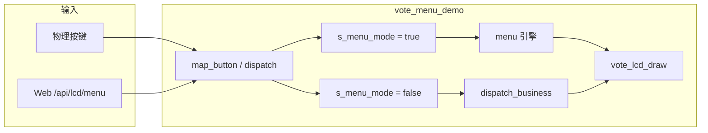
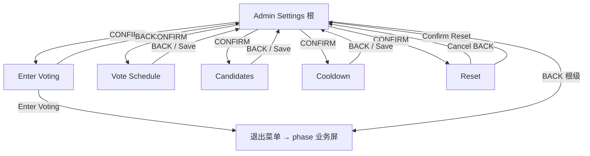
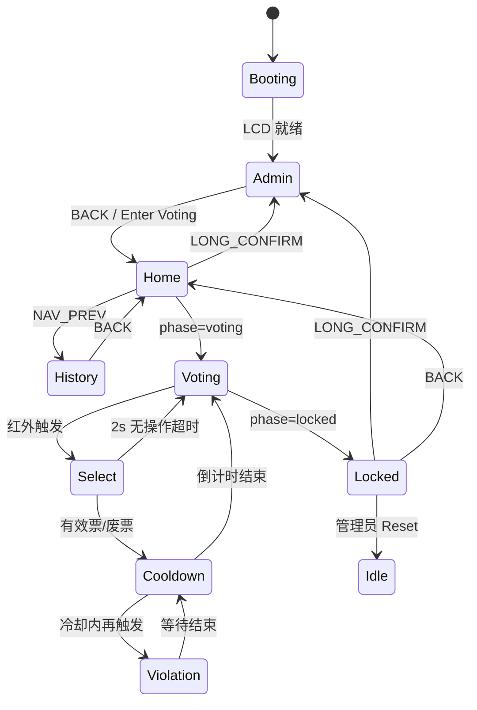

# Ballot Guard · 菜单控制逻辑与产品运行逻辑

**版本**：v1.0（与固件实现对齐）  
**工程**：`ballot_guard/`（ESP32-S3 + ST7789 240×135 + Web）  
**更新**：2026-06-21  

> 本文是 **LCD 菜单控制** 与 **产品运行逻辑** 的合一说明，以当前源码为准，并标注与目标产品行为的差异。  
> 像素级 UI 见 `tmp/ballot_guard_LCD菜单UI设计.md`；GPIO 与外设见 [`ballot_guard_product_usage.md`](./ballot_guard_product_usage.md)。

---

## 1. 文档范围

| 主题 | 本文章节 | 主要源码 |
|:---|:---|:---|
| UI 双模式（菜单 / 业务屏） | §2、§3 | `vote_menu_demo.c` |
| 逻辑动作与按键映射 | §4 | `vote_menu_demo.c`, `button.c` |
| 管理员菜单树与保存 | §5 | `vote_menu_pages.c`, `components/menu` |
| 各业务屏按键行为 | §6 | `vote_menu_demo.c`, `vote_menu_lcd.c` |
| 业务屏返回栈 | §7 | `vote_menu_demo.c` |
| 投票时段 phase 与自动切屏 | §8 | `vote_status.c`, `vote_menu_demo.c` |
| 完整产品运行流程 | §9 | 全文 |
| Web 联动与调试 | §10 | `web_pages.c`, `www/index.html` |
| 持久化（NVS / 历史） | §11 | `vote_nvs.c`, `vote_history.c` |
| 实现缺口 | §12 | — |

---

## 2. UI 架构概览

固件 LCD 层由 **`vote_menu_demo.c`** 统一管理，存在两种互斥模式：



| 模式 | 标志 | 当前画面来源 | 按键处理 |
|:---|:---|:---|:---|
| **管理员菜单** | `s_menu_mode == true` | `menu_current_page()` → 映射为 `VOTE_LCD_SCREEN_ADMIN_*` | `menu_dispatch()` |
| **业务屏** | `s_menu_mode == false` | `s_screen`（`VOTE_LCD_SCREEN_HOME` … `HISTORY`） | `dispatch_business()` |

**上电默认**：自检完成后进入 **管理员菜单根页**（`SCR_ADMIN`），便于首次配网与参数设定。IP 地址仅在管理员页展示。

**退出菜单**：管理员根页 `BACK`、子页逐级 `BACK`、或「Enter Voting」确认 → 调用 `leave_to_app()` → `exit_menu_mode()` → 按当前 **phase** 映射到对应业务屏。

**进入菜单**（从业务屏）：

- 主界面 / 结果锁定屏：**长按确认**（6 键产品为 CONFIRM 长按；开发板 2 键为左键长按）。
- 投票等待 / 选人 / 冷却 / 违规：**不允许**长按进菜单（防误触改配置）。

---

## 3. 画面清单

枚举定义见 `vote_menu_config.h` 的 `vote_lcd_screen_id_t`。

### 3.1 业务屏（7 个）

| ID | 键名（Web） | 名称 | 说明 |
|:---|:---|:---|:---|
| `VOTE_LCD_SCREEN_HOME` | `home` | 主界面 | 待机 / 待开启看板；可浏览候选人得票 |
| `VOTE_LCD_SCREEN_VOTING` | `voting` | 投票等待 | 投票时段内，等待红外或手动进入选人 |
| `VOTE_LCD_SCREEN_SELECT` | `select` | 选人 | 切换候选人、确认有效票 / 登记废票 |
| `VOTE_LCD_SCREEN_COOLDOWN` | `cooldown` | 冷却 | 计票后防重复；显示冷却秒数 |
| `VOTE_LCD_SCREEN_VIOLATION` | `violation` | 违规 | 冷却期内重复靠近（目标行为） |
| `VOTE_LCD_SCREEN_LOCKED` | `locked` | 结果锁定 | 投票结束后的最终结果 |
| `VOTE_LCD_SCREEN_HISTORY` | `history` | 历史记录 | 最近归档场次摘要 |

### 3.2 管理员菜单屏（6 个）

| ID | 键名（Web） | 名称 |
|:---|:---|:---|
| `VOTE_LCD_SCREEN_ADMIN` | `admin` | 管理员根菜单 |
| `VOTE_LCD_SCREEN_ADMIN_TIME` | `admin_time` | 投票时段 |
| `VOTE_LCD_SCREEN_ADMIN_COUNT` | `admin_count` | 候选人数量（2~6） |
| `VOTE_LCD_SCREEN_ADMIN_COOLDOWN` | `admin_cooldown` | 冷却时长（3~10 s） |
| `VOTE_LCD_SCREEN_ADMIN_RESET` | `admin_reset` | 重置确认 |
| `VOTE_LCD_SCREEN_ADMIN_ENTER` | `admin_enter` | 进入投票确认 |

### 3.3 公共布局

240×135 横屏，三区结构（`vote_menu_lcd.c`）：

```
┌─ TITLE_BAR ─── 22px ── 时钟 / 标题 / 状态
├─ BODY ──────── 92px ── 各屏主体
└─ FOOT_HINT ─── 16px ── 操作提示（英文灰字）
```

---

## 4. 逻辑动作与按键映射

交互统一抽象为 **逻辑动作**，再映射到物理按键，菜单引擎与业务分发均消费 `menu_evt_t`（`MENU_EVT_UP/DOWN/LEFT/RIGHT/ENTER/BACK`）。

### 4.1 逻辑动作定义

| 逻辑动作 | 菜单引擎事件 | 含义 |
|:---|:---|:---|
| `NAV_PREV` | `MENU_EVT_UP` | 焦点上移 / 数值减小 / 上一条 |
| `NAV_NEXT` | `MENU_EVT_DOWN` | 焦点下移 / 数值增大 / 下一条 |
| `NAV_LEFT` | `MENU_EVT_LEFT` | 选人屏横向上一候选人 |
| `NAV_RIGHT` | `MENU_EVT_RIGHT` | 选人屏横向下一候选人 |
| `CONFIRM` | `MENU_EVT_ENTER` | 确认 / 进入子项 / 保存 / 有效票 |
| `BACK` | `MENU_EVT_BACK` | 返回上级 / 取消 / 废票（选人屏长按） |
| `LONG_CONFIRM` | 确认键长按 → `ENTER`（条件允许时） | 业务屏进入管理员菜单 |
| `LONG_BACK` | 返回键长按 → `BACK`（仅选人屏） | 登记废票 |

### 4.2 产品 6 键映射（目标）

| 物理按键 | GPIO | 短按 | 长按 |
|:---|:---|:---|:---|
| 上 | 8 | `NAV_PREV` | — |
| 下 | 15 | `NAV_NEXT` | — |
| 左 | 16 | `NAV_LEFT` | — |
| 右 | 17 | `NAV_RIGHT` | — |
| 确认 | 18 | `CONFIRM` | `LONG_CONFIRM`（主界面 / 锁定屏 → 管理员） |
| 返回 | 21 | `BACK` | 选人屏：`LONG_BACK`（废票） |

固件在 `device_profile_button_count() >= 6` 时启用上述映射（`vote_menu_demo.c` → `vote_menu_six_keys()`）。

### 4.3 开发板 2 键映射（当前常见硬件）

| 物理键 | GPIO | 短按 | 长按 |
|:---|:---|:---|:---|
| 左 | 0 | 上 / 选人屏左 | 确认 / 进管理员（主界面·锁定屏） |
| 右 | 3 | 下 / 选人屏右 | 返回 |

菜单未被消费时，左/右短按仍可触发 RGB 演示灯效；左长按可切换 OTA 槽（`start.c`）。

---

## 5. 管理员菜单控制逻辑

菜单页表声明于 `vote_menu_pages.c`，由通用 **`components/menu`** 引擎驱动。

### 5.1 导航树



根菜单五项：

1. **Enter Voting** — 退出管理员，进入当前 phase 对应业务屏（与 Web「进入投票流程」等效）。
2. **Vote Schedule** — 开始/结束 时:分；末项 Save 或末行 CONFIRM 保存。
3. **Candidate Count** — 2~6 人。
4. **Cooldown** — 3~10 秒。
5. **Reset Data** — 二次确认；执行后归档（若有票）、清空计数、恢复默认 cfg 到 NVS。

### 5.2 菜单内按键

| 逻辑动作 | 行为 |
|:---|:---|
| `NAV_PREV` / `NAV_NEXT` | 移动焦点；参数项上/下调整数值 |
| `CONFIRM` | 进入子菜单；参数项跳下一字段；末项 Save 执行保存 |
| `BACK` | 弹出导航栈；根页 `on_root_back` → 退出到业务屏 |

### 5.3 保存与 NVS

- 显式 **Save** 或子页最后一项 **CONFIRM**（`vote_menu_pages_confirm_save()`）→ 写入 NVS（`vote_nvs_save_cfg()`）并 Toast。
- 离开时段/人数/冷却子页时 `on_exit` 会 **静默保存** 当前 RAM 值到 NVS。
- **Reset Confirm** 额外：归档当前场次 → `vote_status_reset_counts()` → `vote_nvs_restore_default_cfg()`。

配置默认值：08:00–16:00、3 人、冷却 5 s；上电 `vote_nvs_init()` 加载到 `vote_menu_settings()`。

---

## 6. 业务屏控制逻辑

业务屏按键由 `dispatch_business()` 处理；未消费的事件在允许长按的屏上可进入管理员菜单。

### 6.1 各屏按键表

| 画面 | NAV_PREV | NAV_NEXT | LEFT/RIGHT | CONFIRM | BACK |
|:---|:---|:---|:---|:---|:---|
| **主界面 HOME** | → 历史记录 | 滚动候选人列表 | — | 无 | 无 |
| **投票等待 VOTING** | — | — | — | — | — |
| **选人 SELECT** | — | — | 切换候选人 | 有效票 +1 → 冷却 | 废票 +1 → 冷却（6 键：返回长按；2 键：右长按） |
| **冷却 COOLDOWN** | — | — | — | — | **→ 返回上一级** |
| **违规 VIOLATION** | — | — | — | — | **→ 返回上一级** |
| **结果锁定 LOCKED** | 滚动列表上 | 滚动列表下 | — | — | **→ 返回上一级** |
| **历史 HISTORY** | 上一条 | 下一条 | — | → 返回 | → 返回 |

底部提示（`vote_menu_lcd.c`）：

- 冷却：`Please wait · Back`
- 违规：`Alarm active · Back`
- 锁定：`Up/Dn  Long OK=menu  Back`（候选人多于 3 人时可滚动）
- 历史：`Prev  Next  Back`

### 6.2 长按进管理员

| 业务屏 | LONG_CONFIRM |
|:---|:---|
| 主界面、结果锁定 | ✅ 允许 |
| 投票等待、选人、冷却、违规 | ❌ 禁止 |

### 6.3 计票路径（选人屏）

```
CONFIRM（短按）  → vote_status_add_valid(idx)  → 冷却屏
BACK（长按废票） → vote_status_add_spoiled()   → 冷却屏
```

进入冷却时，**返回目标固定为投票等待**（`VOTING`），而非选人屏——避免 BACK 回到已结束的选人状态。

> **目标产品**：有效票 / 废票后 RGB 绿闪 / 红闪、蜂鸣反馈；冷却倒计时结束自动回 `VOTING`；冷却期内红外再触发 → `VIOLATION`。**当前固件**：计票写 RAM + NVS 已实现；**红外 GPIO 已初始化并上报 Web**，但尚未绑定选人/违规状态机；冷却倒计时仍为 UI 占位。

---

## 7. 业务屏返回栈

为实现「冷却 / 违规 / 锁定 / 历史可返回上一级」，固件维护：

| 变量 | 作用 |
|:---|:---|
| `s_screen` | 当前业务屏 |
| `s_back_screen` | 进入当前屏之前的业务屏 |

**进入新屏**（`business_nav_to()`）：

- 已在业务模式：当前屏写入 `s_back_screen`。
- 从菜单/Web 跳入业务屏：`s_back_screen = screen_for_current_phase()`（通常为 HOME / VOTING / LOCKED）。

**返回**（`business_nav_back()`）：

- 跳转到 `s_back_screen`；若目标非法或与当前相同，则回退到 `screen_for_current_phase()`。

**Web 切屏**（`vote_menu_demo_goto_screen()`）：跳转前同样记录 `s_back_screen`，便于调试页按 BACK 还原。

---

## 8. 投票 phase 与 LCD 联动

### 8.1 phase 计算

`vote_status_current_phase()` 根据 `vote_menu_settings` 的起止时间与 **当前时钟** 比较：

| phase | 条件 | 中文标签 | 默认映射业务屏 |
|:---|:---|:---|:---|
| `idle` | 未配置有效时段（start ≥ end） | 待机 | HOME |
| `waiting` | 当前时间 < 开始时间 | 待开启 | HOME |
| `voting` | 开始 ≤ 现在 < 结束 | 投票进行中 | VOTING |
| `locked` | 现在 ≥ 结束时间 | 投票已锁定 | LOCKED |

时钟来源：**当前为 `esp_timer` 上电计时**（非 DS3231）。Web JSON 的 `countdown_sec` 随 phase 返回距开始或距结束的秒数。

### 8.2 自动切屏

`vote_menu_task` 每秒调用 `poll_phase_and_archive()`：

- 当 phase **首次**变为 `locked`：归档当前场次（`vote_history_archive_session_if_needed()`），若当前在业务屏且非历史屏，则 `business_nav_to(LOCKED)`。
- 退出管理员菜单 / Enter Voting：切到 `screen_for_current_phase()`。

### 8.3 目标状态机（产品）



**单一状态源（目标）**：上述状态同时驱动 LCD、RGB、`/api/vote/status.phase`。  
**当前**：phase 与 Web 看板已联动；LCD 除 `locked` 自动切入外，**投票流程各屏 mostly 需手动/Web 切换**；**红外 GPIO38/39 已初始化**，尚未驱动 LCD 切屏；RGB / 蜂鸣未绑定状态机。

---

## 9. 产品运行逻辑（端到端）

以下按现场使用顺序描述；标注 **【固件】** 为已实现，**【待办】** 为目标尚未闭环。

### 9.1 上电与自检

1. USB 供电，平台壳层初始化：日志、NVS、板级、按键扫描、RGB、Web（`start.c`）。
2. **【固件】** LCD UI 任务启动，默认 **管理员菜单**；显示 Web 地址（SoftAP 或 STA IP）。
3. **【固件】** `vote_nvs_init()` 加载 cfg、候选人姓名、票数、历史记录。
4. **【待办】** DS3231 自检失败 → 故障屏 + 红灯；黄呼吸启动动画。

### 9.2 首次配置（管理员）

1. **【固件】** 在 LCD 设置投票时段、候选人数量、冷却秒数 → NVS 持久化。
2. **【固件】** 手机连 SoftAP（默认 `192.168.4.1`），Web **网络设置** 配 STA。
3. **【固件】** Web **实时看板** Tab 只读查看 phase / 票数；**候选人英文名** 在 Web `POST /api/vote/candidates` 维护（≤20 字符，字母数字空格连字符），写入 NVS。
4. 选 **Enter Voting** 或 Web `POST /api/vote/session/enter` 退出菜单，进入业务屏。

### 9.3 等待投票开启（waiting）

- **【固件】** Web 看板 `phase=waiting`，显示距开始倒计时。
- **【固件】** LCD 主界面展示候选人得票（可 NAV_NEXT 滚动）。
- **【待办】** RGB 绿色常亮；LCD 顶栏待开启倒计时与 phase 徽章实时刷新。

### 9.4 投票进行中（voting）

1. **【固件】** 到达开始时间后 phase → `voting`；Enter Voting 后 LCD 为投票等待屏。
2. **【待办】** 蜂鸣两短鸣；RGB 蓝色慢闪 1 Hz。
3. **【待办】** 红外 GPIO38/GPIO39 下降沿 → 选人屏，RGB 蓝色快闪 2 s。
4. **【固件】** 选人屏：左/右切换候选人；确认加有效票、返回长按记废票 → 冷却屏。
5. **【待办】** 冷却倒计时（配置 3~10 s）结束自动回投票等待；冷却内再靠近 → 违规屏 + 声光报警。
6. **【固件】** 冷却 / 违规 / 锁定屏可按 **BACK** 返回上一级（调试或人工干预）。
7. **【固件】** 每次计票更新 RAM 并 `vote_nvs_save_votes()`；Web 1 s 轮询可见柱状图变化。

### 9.5 投票结束（locked）

1. **【固件】** 到达结束时间 phase → `locked`；自动归档场次到历史（若本场有票且未归档）。
2. **【固件】** LCD 自动切入结果锁定屏；可滚动查看各候选人得票柱状条。
3. **【待办】** 蜂鸣长鸣 3 s；RGB 绿色常亮。
4. **【固件】** LONG_CONFIRM 进管理员；BACK 回上一业务屏（通常为主界面）。

### 9.6 历史与重置

| 操作 | 行为 | 状态 |
|:---|:---|:---|
| 主界面 NAV_PREV | 进入历史屏，上下翻记录 | **【固件】** |
| 历史 BACK / CONFIRM | 返回上一级 | **【固件】** |
| 管理员 Reset | 归档 → 清票 → 恢复默认 cfg | **【固件】** |
| Web GET `/api/vote/history` | JSON 历史列表 | **【固件】** |
| Web POST `/api/vote/history/clear` | 清空历史 | **【固件】** |

历史 FIFO 最多 **20 条**（`VOTE_HISTORY_MAX_RECORDS`），LCD 按「最新在前」展示。

### 9.7 分工原则

| 能力 | LCD 管理员 | Web |
|:---|:---|:---|
| 投票时段 / 人数 / 冷却 | ✅ | 只读看板 |
| 候选人 **英文名** | 只读展示 | ✅ 增改 |
| 计票 / 废票 | ✅ 选人屏 | ❌ 无写票接口 |
| 重置票数 | ✅ | ❌ |
| LCD 切屏 / 模拟按键 | — | ✅ 调试 Tab |

---

## 10. Web 联动

### 10.1 前端 Tab

| Tab | 功能 |
|:---|:---|
| 实时看板 | 1 s 轮询 `GET /api/vote/status` |
| LCD 调试 | 切换 12 屏；注入 up/down/left/right/enter/back |
| 网络设置 | Wi‑Fi 扫描与 STA 凭据（`web_ctrl`） |

### 10.2 投票相关 REST API

| 方法 | 路径 | 说明 |
|:---|:---|:---|
| GET | `/api/vote/status` | phase、票数、时段、外设、最近事件 |
| GET | `/api/vote/history` | 历史记录 JSON 数组 |
| POST | `/api/vote/history/clear` | 清空历史 |
| GET | `/api/vote/candidates` | 候选人姓名列表 |
| POST | `/api/vote/candidates` | 更新姓名（非 voting/selecting/cooldown 时） |
| POST | `/api/vote/candidates/reset` | 恢复默认 Candidate N |
| POST | `/api/vote/session/enter` | 退出管理员，进入 phase 业务屏 |
| GET | `/api/lcd/menu` | 当前 LCD 屏 ID 与可切换列表 |
| POST | `/api/lcd/menu` | `{"page":"cooldown"}` 或 `{"event":"back"}` |

---

## 11. 持久化（NVS）

命名空间与键由 `vote_nvs.c` 管理，上电 `vote_nvs_init()` 一次加载。

| 数据 | 存储 | 说明 |
|:---|:---|:---|
| cfg（时段/人数/冷却） | NVS | 菜单保存 / 重置恢复默认 |
| cand_* 姓名 | NVS | Web 维护，LCD 只读 |
| vote_* 当前票数 | NVS | 计票后 `vote_nvs_save_votes()` |
| hist_* 历史 | NVS | 归档时追加，最多 20 条 |

Wi‑Fi 凭据仍走 `web_ctrl` 既有 NVS 键，与投票命名空间分离。

---

## 12. 实现缺口与相关文档

### 12.1 与目标产品的差距（摘要）

| 项目 | 目标 | 当前固件 |
|:---|:---|:---|
| 硬件时钟 | DS3231 | `esp_timer` 上电计时 |
| 物理按键 | 6 键 GPIO 8/15/16/17/18/21 | 支持 6 键映射；常见开发板仍为 2 键 |
| 红外防重复 | GPIO38/39 中断驱动选人/违规 | **GPIO 已初始化**；状态机未绑定 |
| 冷却倒计时 | 自动计时并切屏 | UI 占位，秒数可静态/Web 设定 |
| RGB / 蜂鸣 | 与 phase / 投票步骤绑定 | 通用 `led_scene` 演示 |
| 选人超时 | 2 s 无操作回 VOTING | 未实现 |
| LCD phase 文案 | 顶栏实时 countdown / 徽章 | 部分静态 |

详细待办清单见 [`ballot_guard_implementation_status.md`](./ballot_guard_implementation_status.md)（部分条目已随 NVS/历史/计票更新，以本文 §9、§11 为准）。

### 12.2 关键源文件

| 文件 | 职责 |
|:---|:---|
| `vote_menu_demo.c` | UI 任务、双模式、按键、业务分发、返回栈 |
| `vote_menu_lcd.c` | 12 屏绘制 |
| `vote_menu_pages.c` | 管理员菜单页表与 NVS 保存 |
| `vote_status.c` | phase 计算、计票、Web JSON |
| `common/src/board.c` | 板级外设；含红外 GPIO38/39 初始化与中断队列 |
| `start.c` | 上电、按键转发优先级；含 `ir_poll` 红外事件轮询 |
| `vote_nvs.c` / `vote_history.c` | 持久化与归档 |
| `web_pages.c` | HTTP API |

### 12.3 相关文档

| 文档 | 说明 |
|:---|:---|
| [`ballot_guard_product_usage.md`](./ballot_guard_product_usage.md) | GPIO、RGB 目标、Web 字段 |
| [`ballot_guard_implementation_status.md`](./ballot_guard_implementation_status.md) | 实现进度跟踪 |
| [`adr/0001-flat-voting-phase-model.md`](./adr/0001-flat-voting-phase-model.md) | 扁平 Phase 模型 ADR |
| `tmp/ballot_guard_LCD菜单UI设计.md` | 像素级 mockup |

---

*文档随固件演进更新；若评审稿与源码冲突，以本文「与固件实现对齐」描述及 `vote_menu_demo.c` 为准。*
