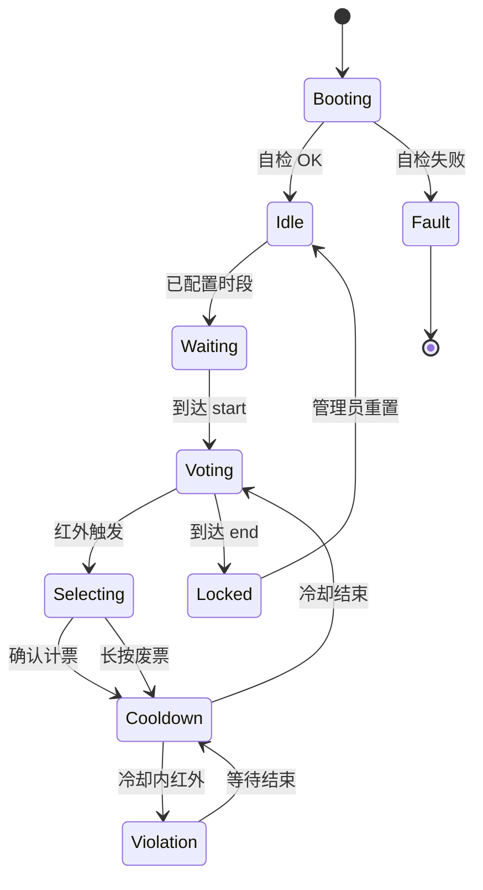

# Ballot Guard · 产品使用逻辑与 GPIO

**版本**：v0.1（与固件实现对齐说明）  
**工程**：`ballot_guard/`  
**依据**：`tmp/产品使用逻辑 + GPIO 硬连接表.md`  
**更新**：2026-06-20  

> **实现进度**见 [`ballot_guard_implementation_status.md`](./ballot_guard_implementation_status.md)。本文描述**目标产品行为**；标注「当前」处为与现版固件的差异。

---

## 一、GPIO 引脚分配表

> **设计原则**：避开 GPIO0（启动风险）、GPIO19/20（UART0 烧录专用）。所有外设引脚无冲突。  
> **ballot_guard 无外置 SD 卡**，GPIO38/39 专用于双路红外传感器（不与 SDMMC 复用）。

| 外设 | 功能信号 | GPIO | 关键电气说明 |
|:---|:---|:---|:---|
| **DS3231 时钟** | SDA | **4** | 外接 4.7kΩ 上拉 |
| | SCL | **5** | 外接 4.7kΩ 上拉 |
| | INT/SQW | 悬空 | 本设计未使用闹钟中断 |
| **LCD (SPI)** | CS | **14** | 低有效 |
| | DC | **10** | 高=数据，低=命令 |
| | RST | **9** | 拉低复位 |
| | MOSI | **11** | SPI 数据 |
| | SCLK | **12** | SPI 时钟 |
| | MISO | **13** | 预留 |
| | BL 背光 | **46** | 软件 PWM 调光 |
| **6 个物理按键** | 上 / 下 / 左 / 右 / 确认 / 返回 | **8, 15, 16, 17, 18, 21** | 输入上拉，按下对地（低有效） |
| **红外传感器 #1** | OUT | **38** | 下降沿中断，触发选人 / 违规检测 |
| **红外传感器 #2** | OUT | **39** | 下降沿中断，与 #1 并联逻辑（任一触发即有效） |
| **蜂鸣器** | PWM | **47** | LEDC 2~4 kHz |
| **RGB (WS2812)** | DATA | **48** | RMT，2~3 颗串联 |
| **烧录 UART0** | RX / TX | **19 / 20** | 仅烧录调试，不复用 |

### 引脚变更摘要（相对早期方案）

- I2C：GPIO10/11 → **GPIO4/5**
- LCD 背光：固定 3.3V → **GPIO46**
- LCD RST：GPIO12 → **GPIO9**；DC：GPIO40 → **GPIO10**
- SPI：MOSI **11**，SCK **12**，MISO **13**（新增预留）
- 按键：上 **8**，下 **15**，左 **16**，右 **17**，确认 **18**，返回 **21**
- 红外：**GPIO38、GPIO39** 双路 proximity（**ballot_guard 无 SD 卡**，不占用 SDMMC 引脚）
- 红外（历史）：原单路 GPIO38；第二路 **GPIO39** 为双传感器扩展

### 当前开发板临时映射

在 6 键硬件到位前，固件使用 **2 键** 验证菜单与 Web：

| 逻辑动作 | 当前绑定 |
|:---|:---|
| NAV_PREV（上） | 左键短按 GPIO0 |
| NAV_NEXT（下） | 右键短按 GPIO3 |
| CONFIRM（确认 / 进入菜单） | 左键长按 |
| BACK（返回） | 右键长按 |

---

## 二、RGB 灯珠状态指示

| 系统状态 | RGB 灯效 | 触发条件 |
|:---|:---|:---|
| 上电初始化中 | 黄色呼吸 | 上电至 LCD 主界面就绪 |
| 待机 / 空闲（可投票） | 绿色常亮 | 非投票时段或投票已结束 |
| 投票进行中 | 蓝色慢闪（1 Hz） | 到达开始时间，红外激活 |
| 红外检测到人靠近 | 蓝色快闪（2 Hz）约 2 s | GPIO38 / GPIO39 任一下降沿 |
| 有效票登记成功 | 绿色快闪 2 次 | 短按确认键 |
| 废票登记 | 红色快闪 3 次 | 长按返回键 2 s |
| 违规重复投票 | 红色急促闪 + 蜂鸣器 | 冷却期内红外再次触发 |
| Wi‑Fi STA 离线 | 黄色常亮 | STA 连路由器失败（SoftAP 仍可用） |
| 系统异常 | 红色常亮 | DS3231 或 LCD 初始化失败 |

> **当前**：RGB 仅上电 boot 场景及按键触发的演示灯效，**未与投票状态机联动**。

---

## 三、完整操作流程

### 阶段 ① 上电与自检

**用户**：USB 供电。

**系统**：

1. RGB **黄色呼吸**，LCD 显示启动信息。
2. 从 NVS 读取参数，初始化 DS3231、I2C、LCD、按键、**红外（GPIO38/39）**、蜂鸣器、RGB。
3. 成功 → **绿色常亮**，LCD 主界面（时间、候选人、总票）。
4. DS3231 或 LCD 失败 → **红色常亮**，LCD 报错，停止服务。

> **当前**：无 DS3231；LCD 菜单直接启动；时间显示为上电计时。

---

### 阶段 ② 管理员系统配置

**入口**：长按 **确认键（GPIO18）** 3 秒进入菜单（**当前**：左键长按 GPIO0）。

**菜单项**：

1. 设置投票开始 / 结束时间（上下调整，确认保存）
2. 设置候选人数量（2~6）
3. 设置冷却时长（默认 5 s，可调 3~10 s）
4. 重置投票数据（二次确认）

退出后 RGB 恢复当前状态色。

> **当前**：菜单四项 UI 与 RAM 读写已实现；**配置未写入 NVS**，重启恢复默认 08:00–16:00、3 人、5 s 冷却。

---

### 阶段 ③ 等待投票开启

- 系统时钟比对起止时间。
- LCD 显示距开始倒计时；RGB **绿色常亮**。
- 手机连 SoftAP（默认 `192.168.4.1`），浏览器打开实时看板，**1 s 自动刷新**。

> **当前**：Web 看板 phase / 倒计时已按菜单时段计算；LCD 主界面 Phase 文案为静态占位。

---

### 阶段 ④ 投票进行中（核心）

**到达开始时间**：蜂鸣器短鸣两声，RGB **蓝色慢闪**，LCD「投票进行中」。

**纯按键投票流程**：

```
红外检测靠近 → 蓝色快闪 2s → LCD「请选择候选人」
       ↓
上下键切换候选人 A→B→C…
       ↓
短按确认 → 有效票 +1 → 绿闪 2 次 → 进入冷却（默认 5s）
       ↓
或长按返回 2s → 废票 +1 → 红闪 3 次 → 冷却
       ↓
冷却期内红外再触发 → 红急促闪 + 蜂鸣 → LCD「违规重复，请等待」
```

票数变动 **1 s 内** 同步至网页柱状图。

> **当前**：各业务 LCD 屏可经 Web「LCD 调试」或部分按键切换预览；**无红外、无计票、无冷却状态机**。

---

### 阶段 ⑤ 投票结束与结果

**到达结束时间**：蜂鸣器长鸣 3 声，RGB **绿色常亮**，LCD「投票已锁定」。

- 网页显示最终柱状图（有效 / 废票 / 各候选人）。
- 管理员可在菜单「重置投票」清空（二次确认）。

> **当前**：phase `locked` 已在 Web JSON 中计算；LCD locked 屏为静态 UI；重置仅清 RAM 计数。

---

### 阶段 ⑥ 历史数据回溯

- 主界面短按 **上键** 进入历史（最近 10 次，含时间戳）。
- 上下翻看，确认 / 返回退出。

> **当前**：LCD 历史屏可进入与翻页索引；**无后端记录**；`GET /api/vote/history` 返回空数组。

---

## 四、Web 使用说明

### 4.1 连接方式

1. 手机 / PC 连接设备 SoftAP，或 STA 模式下访问设备局域网 IP。
2. 浏览器访问 `http://192.168.4.1/`（SoftAP 默认，以实际 IP 为准）。

### 4.2 三个 Tab

| Tab | 用途 | 权限 |
|:---|:---|:---|
| **实时看板** | 状态、票数、柱状图、外设状态、最近操作 | **只读** |
| **LCD 调试** | 切换 12 个 LCD 画面、模拟按键 | 开发 / 演示 |
| **网络设置** | Wi‑Fi 扫描、保存 SSID、清除 STA | 配置路由器 |

> 投票时段、重置等**管理操作仅在 LCD 管理员菜单**，网页 intentionally 不提供写票接口。

### 4.3 看板字段说明

| JSON 字段 | 含义 |
|:---|:---|
| `phase` | `booting` / `idle` / `waiting` / `voting` / `locked` / `fault` |
| `phase_label` | 中文状态标签 |
| `countdown_sec` | 距开始或距结束的秒数 |
| `cooldown_sec` | 当前冷却剩余（计票后） |
| `totals` | `valid` / `spoiled` / `all` |
| `candidates[]` | `name` + `votes` |
| `schedule` | `start` / `end`（HH:MM） |
| `peripherals` | ds3231 / ir / rgb / wifi_ap / wifi_sta |
| `recent_events[]` | 最近操作 `{t, text}` |

---

## 五、LCD 按键逻辑（目标 6 键）

| 逻辑动作 | 目标 GPIO | 典型场景 |
|:---|:---|:---|
| 上 | 8 | 切换上一候选人 / 历史上翻 |
| 下 | 15 | 切换下一候选人 / 历史下翻 |
| 左 | 16 | （预留，菜单横向导航） |
| 右 | 17 | （预留） |
| 确认 | 18 | 有效票 / 菜单确认 / **长按 3s 进管理员** |
| 返回 | 21 | 退出 / **长按 2s 废票** |

---

## 六、模块依赖与降级

| 模块 | 依赖 | 必须 | 失败行为 |
|:---|:---|:---|:---|
| 时钟管控（DS3231） | I2C GPIO4/5 | **是** | 无法启动，LCD 报错 |
| 按键 + LCD | GPIO + SPI | **是** | 无法使用 |
| NVS 参数 | 片内 Flash | **是** | 无法保存配置；单次运行可用 |
| Wi‑Fi 网页 | SoftAP + HTTP | **是（演示）** | STA 离线时 SoftAP 仍可看板 |
| 红外防重复 | GPIO38/39 中断 | **是** | 降级：可计票但无防重复 |
| RGB 指示 | RMT GPIO48 | 否 | 仅缺状态反馈 |
| 蜂鸣器 | PWM GPIO47 | 否 | 仅缺声音提示 |

---

## 七、系统架构（目标）



**单一状态源**：状态机驱动 LCD 文案、RGB、`/api/vote/status` 的 `phase` 三者一致（目标；**当前** LCD 与 Web phase 部分脱节）。

---

## 八、相关文档

| 文档 | 说明 |
|:---|:---|
| [`ballot_guard_implementation_status.md`](./ballot_guard_implementation_status.md) | 已实现 / 待办 / API |
| `tmp/ballot_guard_UI设计评审稿.md` | LCD + Web 视觉与信息架构 |
| `tmp/ballot_guard_LCD菜单UI设计.md` | 12 屏像素布局 |
| [`web_control_http_server_plan.md`](./web_control_http_server_plan.md) | HTTP / Wi‑Fi 基础设施 |
