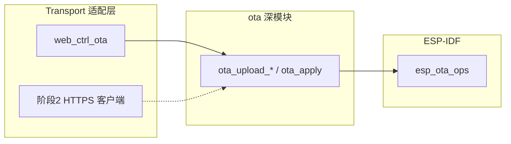

# ESP32-S3 OTA 开发计划与决策记录

**版本**：1.6  
**依据**：[`flash_partition/partitions_16m_n16r8.md`](../flash_partition/partitions_16m_n16r8.md)、[`doc/partition_switch_development_plan.md`](partition_switch_development_plan.md)、[`ota/`](../ota/)  
**状态**：阶段 1（SoftAP 本地 OTA）已在 `project/` **实机验证通过**（2026-06-25）；阶段 2（STA + HTTPS 云端拉包）**未开始**。

---

## 术语（与分区切换文档对齐）

| 术语 | 分区 / API | 说明 |
|------|------------|------|
| **运行槽** `run` | `esp_ota_get_running_partition()` | 当前正在执行的 app 分区 |
| **对侧槽** `target` | `esp_ota_get_next_update_partition()` | OTA 写入目标（非运行槽） |
| **下次启动槽** `next` | `esp_ota_get_boot_partition()` | `otadata` 记录的下次上电槽（`boot_q` / status 展示） |
| **App_A / 槽 A** | `app_a` / `ota_0` | 量产主应用默认槽（见分区表） |
| **App_B / 槽 B** | `app_b` / `ota_1` | 对侧槽 / 厂测备用槽 |

串口 **`boot_a` / `boot_b` / `boot_q`** 走 [`ota/src/boot_slot.c`](../ota/src/boot_slot.c)（`esp_ota_set_boot_partition`）。  
OTA **`apply`** 同样经 IDF OTA API 切槽，**不经过** `boot_slot_request_*`，但语义一致。

---

## 已确认决策

| # | 议题 | 决策 | 日期 | 备注 |
|---|------|------|------|------|
| D1 | OTA 首要使用场景 | **E：分阶段组合** | 2026-06-25 | **阶段 1**：SoftAP 本地上传。**阶段 2**：STA + HTTP(S) 云端拉包。 |
| D2 | OTA v1 覆盖工程 | **A：仅 `project/`** | 2026-06-25 | v1 在量产工程打通全链路；`ballot_guard/` 待 v1.1 复用 `ota`。 |
| D3 | Bootloader rollback | **A：v1 即启用** | 2026-06-25 | `CONFIG_BOOTLOADER_APP_ROLLBACK_ENABLE`；**平台自检全部通过后**调用 `esp_ota_mark_app_valid_cancel_rollback()`（见「Rollback 保护窗口」）。 |
| D4 | 镜像签名校验 / Secure Boot | **D：分阶段** | 2026-06-25 | 阶段 1：仅 `esp_ota_end` 合法性检查。阶段 2：至少 SHA256 + `manifest.json` 字段校验。 |
| D5 | 阶段 1 OTA 触发入口 | **E：Web 页 + HTTP API** | 2026-06-25 | `/ota` 维护页 + 独立 REST（见 D8）；v1 不含串口 OTA 命令。 |
| D6 | 版本号与 anti-rollback | **D：硬拒绝降级 + 统一版本源** | 2026-06-25 | 新包版本须**严格大于**当前（semver 三段比较）；`PROJECT_VER` → `esp_app_desc.version` + `NVS_APP_VERSION_STRING`（[`common/CMakeLists.txt`](../common/CMakeLists.txt)）。**未**启用 eFuse `CONFIG_BOOTLOADER_APP_ANTI_ROLLBACK`（阶段 2 再评估）。 |
| D7 | 升级失败与断电行为 | **B：旧槽保底 + abort 清理** | 2026-06-25 | 见「边界场景」；断连 `esp_ota_abort`；写完未 `apply` 仍旧槽；崩溃 rollback（D3）。 |
| D8 | HTTP API 形态 | **A：独立 `/api/ota/*`** | 2026-06-25 | 不走 `/api/cmd`；与 `/api/wifi/*` 同风格，支持大文件与长会话。 |

---

## 边界场景（D7）

| 场景 | 期望行为 |
|------|----------|
| **S1** 写入过程中断电/断连 | 继续从**旧槽**运行；**`esp_ota_abort`**；对侧槽半成品**不可 apply**，下次覆盖重写 |
| **S2** `esp_ota_end` 成功、尚未 `apply` | 仍从**旧槽**启动；用户 **`POST /api/ota/apply`** 后再 `esp_ota_set_boot_partition` + 复位 |
| **S3** 已 `apply` 但新固件在 **mark_valid 之前**反复崩溃 | Bootloader **rollback** 回旧槽（D3） |
| **S4** 上传版本 ≤ 当前版本 | **`ota_upload_begin` 拒绝**（D6），HTTP **409** |
| **S5** 新上传抢占旧会话 | 新 `upload` 前 **`abort` 旧会话**再开始（单会话抢占，非 503 排队） |

---

## Rollback 保护窗口（D3 细化）

新固件 `apply` 重启后处于 **`ESP_OTA_IMG_PENDING_VERIFY`**，在调用 `esp_ota_mark_app_valid_cancel_rollback()` 之前，Bootloader 可因启动失败自动回滚。

| 项目 | 阶段 1 现状 | 目标（W1.1） |
|------|-------------|--------------|
| **调用点** | `app_init()` 全阶段 OK 后，或 `web_ctrl_start` 成功后（W1.1） | 同上（已实现） |
| **保护范围** | 覆盖 BoardInit / 按键 / 灯效失败；Web 启动失败时不 mark_valid | 阶段 2 前可再评估业务任务（LCD/SD）是否纳入 |
| **O5 测试** | 须使用 **在 mark_valid 之前崩溃** 的专用测试固件（如 `app_main` 最早路径 `abort()`） | 文档化测试包构建方式 |

**原则**：「启动成功」= 文档 D3 与 W1 所指的自检通过，**不等于**仅 BoardInit 返回 OK。

---

## 阶段 1 HTTP API

与 `web_ctrl` 现有 REST 风格一致；SoftAP 下 **写操作**（upload / abort / apply）限制在 AP 子网（对齐 `/api/wifi/save`）。`GET /api/ota/status` 与 `GET /ota` 只读，不限子网。

| 方法 | 路径 | 作用 |
|------|------|------|
| `GET` | `/ota` | 维护页（选文件、进度、确认重启） |
| `GET` | `/api/ota/status` | JSON：`state`、`run`、`target`、`run_ver`、`pending_ver`、`written`、`total` |
| `POST` | `/api/ota/upload` | 二进制 body（`Content-Length` 必填）；`ota_upload_begin` → 分块 `ota_upload_write` → `ota_upload_end` |
| `POST` | `/api/ota/abort` | 放弃当前会话（S1、S5） |
| `POST` | `/api/ota/apply` | `OTA_SESSION_READY` 时 `esp_ota_set_boot_partition` + `esp_restart()`（S2） |

### 会话与并发

- **全局单会话**：内存状态机 `idle` / `writing` / `ready`（[`ota/inc/ota.h`](../ota/inc/ota.h)）。
- **抢占策略**：新 `upload` 会先 `abort` 旧会话再 `begin`（S5）；**非**「进行中返回 503 拒绝第二路」。
- 互斥：`ota` 内部 mutex；HTTP 层与 `web_ctrl_ota.c` 串行处理单连接上传。

### 常见 HTTP 状态

| 状态 | 含义 |
|------|------|
| **409** | 版本不高于当前（D6） |
| **403** | SoftAP 下客户端不在 AP 子网 |
| **411** | 缺少 `Content-Length` |
| **413** | 超过 `CONFIG_WEB_CTRL_OTA_UPLOAD_MAX`（默认 8 MiB） |
| **408** | 接收超时（触发 abort，S1） |
| **503** | 内部 `ESP_ERR_INVALID_STATE`（少见；正常流程靠 abort 重置） |

实现：[`components/web_ctrl/src/web_ctrl_ota.c`](../components/web_ctrl/src/web_ctrl_ota.c)。

---

## 代码布局（阶段 1 已完成）

```
ota/
  CMakeLists.txt     # IDF 组件注册
  inc/ota.h          # 会话 API + ota_status_t
  inc/boot_slot.h    # 串口切槽（与 OTA apply 并行）
  src/ota.c          # begin/write/end/abort/apply/confirm
  src/boot_slot.c
components/web_ctrl/
  src/web_ctrl_ota.c # HTTP 适配层（Kconfig WEB_CTRL_OTA）
project/
  sdkconfig.defaults # CONFIG_WEB_CTRL_OTA, CONFIG_BOOTLOADER_APP_ROLLBACK_ENABLE
  main/start.c       # ota_confirm_running_image()（W1.1：app_init / web_boot 成功后）
```

**版本同源链**：`PROJECT_VER`（[`project/CMakeLists.txt`](../project/CMakeLists.txt) 或 `idf.py release -DPROJECT_VER`）→ `esp_app_desc.version` → compile def `NVS_APP_VERSION_STRING` → 运行时 NVS `appver` 同步（[`common/src/nvs.c`](../common/src/nvs.c)）。详见 [`firmware/README.md`](../firmware/README.md)。

---

## 架构（模块与 seam）



- **Transport seam**：HTTP 上传与未来的 HTTPS 拉包均应对接同一 `ota` 状态机，避免两套 `begin/end` 行为分叉。
- **校验 seam（阶段 2）**：在 `ota_upload_begin` 之前或 `esp_ota_end` 之后插入 manifest / SHA256 校验，不嵌入 `web_ctrl`。

---

## 实现 WBS

### 阶段 1 — v1（已完成）

#### W1：配置与版本

- [x] `project/sdkconfig.defaults` / `project/bootloader/sdkconfig.defaults`：`CONFIG_BOOTLOADER_APP_ROLLBACK_ENABLE`
- [x] `PROJECT_VER` 单一来源；`NVS_APP_VERSION_STRING` 由 CMake 注入
- [x] `ota_confirm_running_image()` 接入启动流程

#### W1.1：Rollback 窗口补强（已完成）

- [x] 将 `ota_confirm_running_image()` 移至 **`app_init()` 全阶段成功之后**（Web 异步时改由 `web_boot` 任务在 `web_ctrl_start` 成功后调用）
- [x] 自检失败路径：**不** mark_valid，保留 rollback 能力
- [x] 文档化 O5 专用 crash 测试固件构建方式（Kconfig `CONFIG_OTA_ROLLBACK_TEST`）

#### W2：`ota` 核心

- [x] [`ota/inc/ota.h`](../ota/inc/ota.h)、[`ota/src/ota.c`](../ota/src/ota.c)
- [x] `esp_ota_get_next_update_partition()` 选对侧槽
- [x] `ota_upload_begin`：首包解析 `esp_app_desc`、semver 比较（D6）
- [x] `ota_upload_write` / `ota_upload_end` / `ota_upload_abort`（D7）
- [x] `ota_apply`：`OTA_SESSION_READY` 检查 + `esp_ota_set_boot_partition` + 复位
- [x] `common/CMakeLists.txt` 注册，`REQUIRES app_update`

#### W3：`web_ctrl` 集成

- [x] `web_ctrl_ota_register()`：`/api/ota/*` + `GET /ota`
- [x] Kconfig `WEB_CTRL_OTA`、`WEB_CTRL_OTA_UPLOAD_MAX`
- [x] `/ota` 页：轮询 status、客户端版本预检、apply/abort
- [x] 仅 `project/` 启用 `CONFIG_WEB_CTRL_OTA`

#### W4：测试与文档

- [x] 测试矩阵 O1–O4、O6 — **2026-06-25 实机通过**（`run_ver` 递增至 1.0.2）
- [x] O5 rollback — **有条件通过**（须 crash 固件在 mark_valid 前失败；见「Rollback 保护窗口」）
- [x] [`README.md`](../README.md) OTA 维护说明

#### W4.1：文档与 UI 同步（已完成）

- [x] `/ota` 页文案：改为推荐 **`idf.py release`** 产物名（`project_x.y.z_YYYYMMDD.bin`），弱化「手改 CMakeLists」
- [x] 指向 `manifest.json` → `products.project.ota.image` 作为现场选文件依据

---

### 阶段 2 — STA + HTTPS 云端 OTA（未开始）

#### 目标

- STA 联网后从 URL 拉取 release 包；校验与切换仍走 `ota` + D3/D7。
- 设备端消费 [`firmware/<ver>/manifest.json`](../firmware/README.md)（schema 2）中的 **SHA256**（D4）。
- `ballot_guard/` 启用 `CONFIG_WEB_CTRL_OTA`（D2 v1.1）。

#### 待决事项（阶段 2 开工前 Grill）

| # | 议题 | 选项 | 倾向 |
|---|------|------|------|
| P2-1 | 下载实现 | A) `esp_https_ota` 整体 B) HTTP(S) 流式下载 + 喂给 `ota_upload_*` | **B**（复用状态机） |
| P2-2 | manifest 校验点 | A) begin 前仅比 version B) end 后比 SHA256 C) 两者 | **C** |
| P2-3 | STA 写操作安全 | A) 维护 PIN B) 仅允许已配对 VLAN C) mTLS 客户端证书 | 待产品定 |
| P2-4 | eFuse anti-rollback | 是否启用 `CONFIG_BOOTLOADER_APP_ANTI_ROLLBACK` | 与产线烧录流程一并评估 |
| P2-5 | 断点续传 | v2.0 是否需要 Range / 已写字节续传 | 阶段 2 可不做 |

#### WBS 草案

| 任务 | 内容 | 估时 |
|------|------|------|
| **W5** | `ota`：导出可复用的 header 校验 / SHA256 钩子；HTTPS 下载 adapter（`ota_pull_from_url` 或独立 `ota_transport_https.c`） | 2～3 天 |
| **W6** | manifest 解析（轻量 JSON 或 codegen）；与 release 脚本 schema 对齐 | 1 天 |
| **W7** | `web_ctrl` 或后台任务：STA 触发入口（API / 定时 / NVS 配置 URL）；**非 SoftAP 安全策略**（P2-3） | 1～2 天 |
| **W8** | 测试矩阵 O7–O10：HTTPS 拉包、篡改包拒绝、STA 权限、断网重试 | 1～2 天 |
| **W9** | `ballot_guard` 集成 + 文档 | 0.5～1 天 |

#### 阶段 2 验收要点

- O7：STA 下从 manifest URL 拉取合法包 → apply → 对侧槽运行
- O8：SHA256 不匹配 → 拒绝，`ota_abort`，旧槽不变
- O9：拉取中断 → 同 S1
- O10：仍满足 D6 降级拒绝、D3 rollback（在 W1.1 完成后复测 O5）

---

## 测试矩阵

### 阶段 1（验收）

| 编号 | 前置 | 操作 | 期望 | 状态 |
|------|------|------|------|------|
| O1 | A 槽运行合法镜像 | 上传更高版本 `.bin` → apply | 重启进入 B 槽；mark_valid 后 rollback 取消 | ✅ |
| O2 | 同 O1 | 上传中途断连 | 仍 A 槽；state `idle`；不可 apply | ✅ |
| O3 | 同 O1 | 上传完成不 apply 后断电 | 仍 A 槽 | ✅ |
| O4 | 同 O1 | 上传低版本 | begin 拒绝，HTTP 409 | ✅ |
| O5 | 对侧槽待启动镜像 | apply **crash-test 固件**（mark_valid **前**崩溃） | rollback 回旧槽 | ⚠️ 见 Rollback 窗口 |
| O6 | 两槽均有镜像 | `boot_q` / `GET /api/ota/status` | 正确 `run` / `target` / `run_ver` | ✅ |

**O5 测试包要求**：在 `ota_confirm_running_image()` 调用点**之前**触发复位或 `abort()`；不可用「业务任务运行时崩溃」代替，否则当前实现已 mark_valid。

**O5 构建**（仅测试，勿量产）：

```powershell
# menuconfig → Component config → OTA → OTA rollback test
# 或一次性编译：
idf -Project project build -DCONFIG_OTA_ROLLBACK_TEST=y
```

启用 `CONFIG_OTA_ROLLBACK_TEST` 后，`app_init()` 最早路径会 `abort()`，Bootloader 应 rollback 至旧槽。

### 阶段 2（规划）

| 编号 | 操作 | 期望 |
|------|------|------|
| O7 | STA + manifest URL 拉包 | 同 O1 |
| O8 | 篡改 bin 或 SHA256 | end 或校验阶段失败，旧槽运行 |
| O9 | HTTPS 下载中断 | 同 O2 |
| O10 | W1.1 完成后复测 O5 | rollback 在「平台自检失败」时生效 |

---

## 分阶段交付摘要

### 阶段 1 — SoftAP 本地 OTA（v1）✅

- **传输**：`/ota` + `/api/ota/*`（D5、D8）
- **核心**：`ota` + rollback（D3）+ semver 禁降级（D6）+ abort（D7）
- **安全**：无签名校验；SoftAP 写操作子网限制（D4 阶段 1）
- **范围**：仅 `project/`（D2）
- **发布**：`idf.py release` → [`firmware/`](../firmware/README.md)

### 阶段 2 — STA + HTTPS 云端 OTA

- SHA256 + manifest（D4）；下载 adapter 对接 `ota`
- STA 安全模型（P2-3）；可选 eFuse anti-rollback（P2-4）
- `ballot_guard/` 复用（D2）；验收仍须 D3/D6/D7

---

## 发布工作流（与 OTA 配合）

| 步骤 | 命令 / 产物 |
|------|-------------|
| 打 release 包 | `idf -Project project release 1.2.3`（注入 `PROJECT_VER`；默认仅 OTA app；产线首次烧录加 `--flash-bundle`） |
| 归档位置 | `firmware/1.2.3/project_1.2.3_YYYYMMDD.bin` 等 |
| 选哪个文件 | `firmware/<ver>/manifest.json` → `products.project.ota.image` |
| 现场 OTA | SoftAP 连接 → `http://192.168.4.1/ota` → 上传上述 `.bin`（版本须 **高于** 设备 `run_ver`） |

PowerShell 包装：[`idf.ps1`](../idf.ps1)、[`scripts/release.ps1`](../scripts/release.ps1)。详见 [`firmware/README.md`](../firmware/README.md)。

---

## Grill 队列

**阶段 1 决策（已冻结）**

- [x] D1 → E　[x] D2 → A　[x] D3 → A　[x] D4 → D  
- [x] D5 → E　[x] D6 → D　[x] D7 → B　[x] D8 → A  

**阶段 2 待 Grill**

- [ ] P2-1 下载实现　[ ] P2-2 manifest 校验点　[ ] P2-3 STA 安全  
- [ ] P2-4 eFuse anti-rollback　[ ] P2-5 断点续传范围  

---

## 变更记录

| 日期 | 版本 | 说明 |
|------|------|------|
| 2026-06-25 | 0.1–0.7 | Grill D1–D7 逐项确认 |
| 2026-06-25 | 1.0 | Grill D8 确认（A）；决策冻结；API 草案、WBS、测试矩阵 |
| 2026-06-25 | 1.1 | 实现阶段 1：ota、web_ctrl OTA HTTP、rollback、PROJECT_VER |
| 2026-06-25 | 1.2 | 实机验收通过（run=app_b, run_ver=1.0.2） |
| 2026-06-25 | 1.3 | 新增 `idf.py release` 与 `firmware/` 发布目录 |
| 2026-06-26 | 1.4 | 文档与实现对齐：术语表、路径修正、并发/HTTP 码、rollback 窗口与 O5 说明、架构 seam、阶段 2 WBS/P2 待决、W1.1/W4.1 待办 |
| 2026-06-26 | 1.6 | W1.1 rollback 窗口：`ota_confirm` 后移至 app_init / web_boot；`CONFIG_OTA_ROLLBACK_TEST`；W4.1 `/ota` 页文案 |
