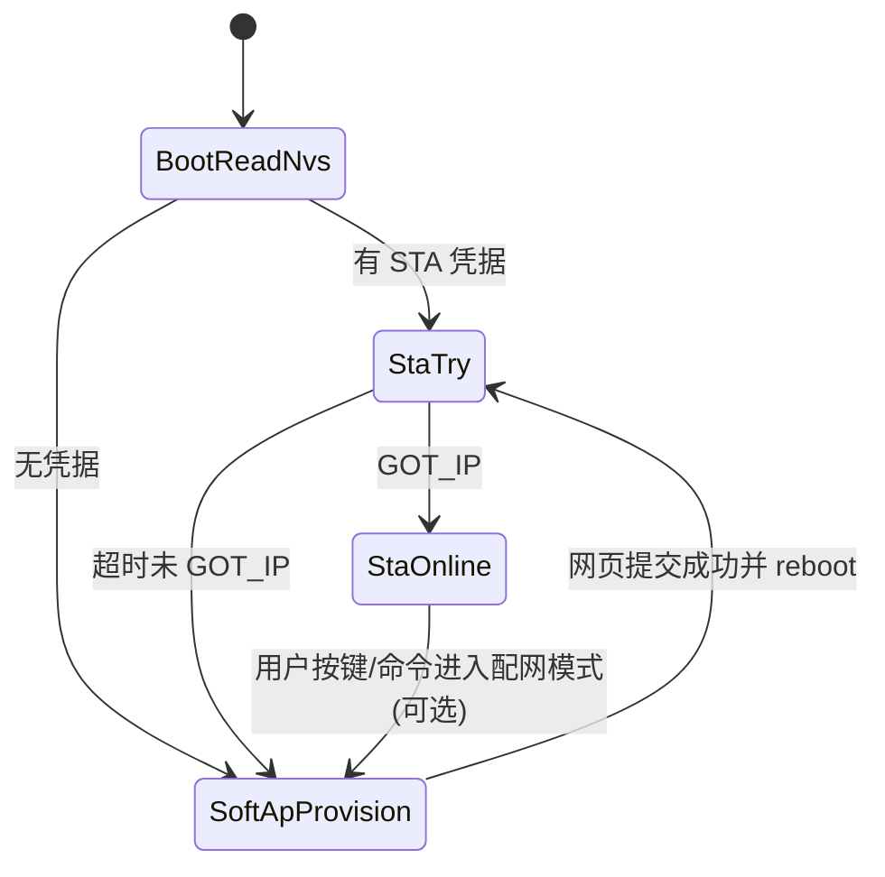

# SoftAP 网页配网（无路由器时通过设备本地 Web 写入 STA 凭据）开发计划

**版本**：1.0  
**角色定位**：资深嵌入式 / ESP-IDF 工程视角下的 **可执行 WBS**，与现有 **`components/web_ctrl`** 栈对齐，而非重复造「另一套 Web 服务」。  
**关联文档**：[`doc/web_control_http_server_plan.md`](web_control_http_server_plan.md)（HTTP + SoftAP 基座已实现）；[`doc/application_architecture.md`](application_architecture.md)（分层与任务约定）；[`doc/embedded_coding_standard.md`](embedded_coding_standard.md)；组件说明 [`components/web_ctrl/README.md`](../components/web_ctrl/README.md)。

---

## 1. 需求与边界

### 1.1 用户场景（已确认）

设备 **尚未连接任何外部 AP（无 STA `GOT_IP`）** 时，仍希望：

1. 设备以 **SoftAP** 形式提供局域网；
2. 手机/PC 连上该热点后，通过 **浏览器页面** 选择/输入目标 Wi‑Fi（SSID、密码），必要时 **扫描周边 AP**；
3. 将凭据 **持久化**（NVS），并在合适时机 **以 STA 连接目标网络**，供后续在局域网内访问同一套 Web 控制或其它业务。

### 1.2 与「公网服务器」的区分

本计划 **不包含** 设备在未配网状态下对互联网暴露 HTTP 服务；仅覆盖 **SoftAP 网段内的本地 HTTP 配网**。

### 1.3 非目标（首版可明确排除）

| 项 | 说明 |
|----|------|
| 云端账号绑定、OAuth | 若有需求另立文档。 |
| 完整 **HTTPS** 配网页 | SoftAP 侧证书管理成本高；首版以 **WPA2 SoftAP + 局域网明文 HTTP** 为主，与当前 `web_ctrl` 一致，生产再评估 HTTPS / 令牌。 |
| 与 ESP-IDF **`wifi_provisioning`** 组件 **完全等价** 的协议栈 | 可选对标参考；本仓库优先 **轻量 REST + 现有 `esp_http_server`**，降低与 `cmd` 桥接、NVS 键的割裂。 |

---

## 2. 现状差距分析（仓库内）

| 能力 | 当前状态 | 配网页所需 |
|------|----------|------------|
| SoftAP + DHCP + 固定 AP IP（典型 `192.168.4.1`） | **`net_wifi.c`** 已实现 | 直接复用 |
| HTTP 服务 + JSON API | **`web_server.c`** 已有 `GET /`、`GET /api/health`、`POST /api/cmd` | 增加 **`/api/wifi/*`** 或独立 **`/provision/*`** 路由 |
| STA 凭据写入 NVS | USB 命令 **`webcfg`** + `web_ctrl_config_merge_nvs` 等（见 README） | 网页路径需 **同一 NVS 模型** 或薄封装，避免两套「真相源」 |
| **`net_wifi`** 模式 | 仅 **`WIFI_MODE_AP`** 与 **`WIFI_MODE_STA`** 二选一，**无 APSTA** | 「边开热点边扫网/试连」需 **`WIFI_MODE_APSTA`** 或 **配网流程内短时切换模式**（见 §4） |
| Wi‑Fi **扫描** | 未封装 | 需在 **非 HTTP 长阻塞** 上下文调用 `esp_wifi_scan_start` / `esp_wifi_scan_get_ap_records` |
| **Captive Portal**（连热点自动弹浏览器） | 未实现 | 可选增强；涉及 DNS 劫持/404 引导，分阶段做 |

---

## 3. 方案总览

### 3.1 推荐产品策略（二选一，立项时冻结）

**策略 A：冷启动「先 STA 后 SoftAP」**

1. 上电读取 NVS 中 STA 凭据；若有则 **`NET_WIFI_MODE_STA`** 启动并连接，超时未 `GOT_IP` 则停 STA，切 **SoftAP + HTTP 配网页**。
2. 配网成功后写 NVS，**重启** 进入策略 A 步骤 1（实现简单、状态清晰）。

**策略 B：常驻 APSTA（开发友好，RAM/功耗略高）**

1. 始终 **`WIFI_MODE_APSTA`**：SoftAP 保持配网页可达；STA 侧连外网路由器。
2. 需扩展 **`net_wifi`** 与 **`esp_netif`** 双接口、事件与路由策略，并明确 **默认路由**（通常 STA 为默认出口）。

**建议**：首版采用 **策略 A**；策略 B 作为「量产高级选项」或第二阶段。

### 3.2 与官方 `wifi_provisioning` 的关系

| 路径 | 优点 | 缺点 |
|------|------|------|
| 引入 **`wifi_provisioning` + protocomm** | 协议与手机端生态成熟 | 与本项目已有 HTTP/`cmd` 并行，集成与体积成本需评估 |
| **自研 REST（推荐与当前栈一致）** | 与 `web_server.c`、`persist`/NVS 统一；调试直观 | 需自行处理扫描时序、错误码、安全边界 |

本计划默认 **自研 REST**；若产品强制兼容 Espressif 配网 App，可在阶段 0 改为「以 `wifi_provisioning` 为主、Web 为辅」并修订 WBS。

---

## 4. 架构与并发约束（嵌入式要点）

### 4.1 状态机（策略 A 示例）

### 4.2 Wi‑Fi 扫描与 HTTP 回调

- **`esp_wifi_scan_start` 默认阻塞时间可达数百 ms～数秒**，且与连接状态交互复杂。  
- **禁止**在 `httpd` 回调线程里长时间等待扫描结束（易触发 **看门狗**、拖死 TCP）。  
- **推荐**：专用 **`net_wifi` 或 `web_ctrl` 下属任务** + **队列**；HTTP handler 仅 **投递扫描请求并返回 202 + `scan_id`**，或 **小超时同步**（仅开发调试用）。量产界面用 **轮询 `GET /api/wifi/scan_result`** 更稳。

### 4.3 与 `cmd_process_line_for_web` 的关系

- 配网 API **不必**全部走 `POST /api/cmd`：STA 写入、扫描等属于 **网络子系统**，建议 **`web_server.c` → 专用模块（如 `web_ctrl_wifi_api.c`）→ `net_wifi` / NVS**，避免把过长 JSON 塞进单行 `cmd`。  
- 若希望厂测统一：**可**增加 `wifi_scan` / `wifi_set_sta` 等 **USB 同行命令**，网页与串口共用实现（减少重复逻辑）。

### 4.4 `net_wifi` 扩展要点

1. 增加 **`NET_WIFI_MODE_APSTA`**（或内部标志）时：  
   - `esp_netif_create_default_wifi_ap` + `esp_netif_create_default_wifi_sta`；  
   - `esp_wifi_set_mode(WIFI_MODE_APSTA)`；  
   - 分别 `esp_wifi_set_config(WIFI_IF_AP|STA, ...)`。  
2. **模式切换**：从 AP 切到 STA 再切回 AP 时，注意 **`esp_wifi_stop` → `esp_wifi_deinit` 顺序** 与现有 `net_wifi_stop` 幂等，避免与 `httpd` 生命周期死锁（先停 HTTP 再停 Wi‑Fi 的规则在 `web_ctrl.c` 已建立，模式切换时须复用同一原则）。  
3. **信道**：STA 连接后 AP 信道可能被驱动联动，需在实机记录日志并写入 README。

---

## 5. HTTP API 草案（与实现迭代时同步修订）

以下命名仅为计划期约定，落地时可合并到 `web_server.c` 或拆文件。

| 方法 | 路径 | 行为 |
|------|------|------|
| `GET` | `/api/wifi/status` | JSON：当前模式、STA 连接状态、`rssi`、是否「配网中」标志等 |
| `POST` | `/api/wifi/scan` | 触发异步扫描；返回 `scan_id` 或 `202` |
| `GET` | `/api/wifi/scan_result?scan_id=` | 返回 AP 列表（SSID/BSSID/信道/auth 简化枚举） |
| `POST` | `/api/wifi/sta` | Body：`{"ssid":"...","password":"..."}`；**试连**（可选：不写 NVS） |
| `POST` | `/api/wifi/save` | 校验通过后写入 **与 `webcfg` 一致的 NVS**，并 **`esp_restart()`** 或提示用户重启 |
| `GET` | `/provision` 或 `/` 子页 | 专用配网 **单页应用（可仍内嵌 HTML）**；与现有 `GET /` 联调页可合并或分离 |

**安全**：`save` 前要求 **SoftAP 已连接**（根据 `WIFI_EVENT_AP_STACONNECTED` 或简单「仅允许来自 AP 网段 IP 的写操作」）；生产可再加 **一次性 Token**（重启失效）。

---

## 6. 分阶段 WBS 与交付物

### 阶段 0：需求与策略冻结（0.5～1 天）

- 选定 **§3.1 策略 A 或 B**；定义「无 STA 凭据」「STA 失败重试次数/超时」默认值。  
- 确认 NVS：**复用现有 `web_ctrl` / `webcfg` 键**，避免网页写入与 USB 命令冲突。  
- **交付物**：本文档 §3.1 勾选结果 + `components/web_ctrl/README.md` 将来增补「配网页」章节的目录草案。

### 阶段 1：只读能力（1～2 天）

- 实现 **`GET /api/wifi/status`**（从事件位或 `esp_wifi_sta_get_ap_info` 等聚合）。  
- **交付物**：实机日志截图或记录：SoftAP 下访问 status 与 STA 模式下差异符合预期。

### 阶段 2：扫描管线（2～3 天）

- 扫描任务 + 结果环形缓冲或单次缓冲；定义 **scan 超时** 与 **并发互斥**（扫描与 STA 连接互斥策略查 IDF 文档）。  
- **`POST /api/wifi/scan` + `GET /api/wifi/scan_result`**。  
- **交付物**：手机连 SoftAP 后页面可列出周边 SSID（隐藏 SSID 以 BSSID 行展示可选）。

### 阶段 3：写 NVS + 重启连网（1～2 天）

- **`POST /api/wifi/save`**：校验长度、开放/加密网络分支；调用现有 NVS 写入路径；**重启**。  
- 与 **`webcfg save`** 行为一致性的**单测或厂测脚本**（curl 序列）。  
- **交付物**：冷启动从未配网到 STA `GOT_IP` 全流程无人工串口。

### 阶段 4：配网前端与体验（1～2 天）

- 极简表单：SSID 下拉/手输、密码、保存按钮、错误提示（`WIFI_REASON_*` 映射简短中文/英文）。  
- **交付物**：`README` 更新连接步骤；与 [`doc/compile_flash_erase_monitor.md`](compile_flash_erase_monitor.md) 交叉链接一句即可（若该文档暂无 Web 小节）。

### 阶段 5（可选）：Captive Portal

- SoftAP 网段内置 **DNS 服务器**（或 `esp_netif` 相关钩子）将常见探测域名解析到 `192.168.4.1`；HTTP 对任意 Host 返回 `302` 到 `/provision`。  
- **交付物**：iOS/Android 样机各至少一台验证「连热点后自动或半自动打开配网页」；记录失败机型与规避说明。

### 阶段 6（可选）：硬化

- 写接口 **速率限制**、**失败锁定**（连续错误密码暂停 `save`）、Kconfig 开关 **`WEB_CTRL_PROVISION_ENABLE`**。  
- 与 [`doc/web_control_http_server_plan.md`](web_control_http_server_plan.md) **阶段 5**（HTTP 全局硬化）合并验收。

---

## 7. 风险登记与缓解

| 风险 | 缓解 |
|------|------|
| 扫描时用户掉线 SoftAP | 扫描频率限制；UI 提示「扫描中勿离开页面」；缩短扫描信道集（监管域配置 `esp_wifi_set_country`）。 |
| NVS 与运行时双写 | 所有写入经 **单 mutex** 或 **单一 `persist` API**；网页与 `webcfg` 共用。 |
| AP/STA 切换导致 HTTP 短暂不可用 | 策略 A 在 **重启** 前给出 JSON 明确提示；策略 B 保持 AP 不杀进程。 |
| 密码明文 POST | SoftAP 强密码 + 物理接触假设；后续 HTTPS/摘要认证。 |

---

## 8. 验收标准（建议）

1. **无串口参与**：仅通过手机连默认 SoftAP（或 NVS 定制 SSID），完成 **扫描 → 选网 → 输入密码 → 保存 → 重启（若采用策略 A）→ STA `GOT_IP`**。  
2. **与现有功能共存**：保存后 **`GET /api/health`**、**`POST /api/cmd`** 在 STA 网段仍可用（与当前架构一致）。  
3. **稳定性**：连续 **5 次** 切换不同错误密码/正确密码，无 NVS 损坏、无 `heap_caps` 断言失败（抽样 `heap_caps_check_integrity_all`）。  
4. **`idf.py build`** 通过；关键路径 `ESP_LOGI/W` 可支撑现场排障。

---

## 9. 变更记录

| 日期 | 版本 | 说明 |
|------|------|------|
| 2026-05-14 | 1.0 | 初稿：与 `web_ctrl` / `net_wifi` 现状对齐的 SoftAP 网页配网 WBS |

---

**实施入口建议**：在 `components/web_ctrl` 内新增 **`web_ctrl_wifi_api.c/.h`**（或并入 `web_server.c` 若保持单文件），由 `web_ctrl.c` 在 `net_wifi_start` 与 `web_server_start` 之间注册路由依赖；**`net_wifi.h`** 扩展模式枚举与 **扫描/状态查询** C API，**禁止**在 HTTP 直连 `esp_wifi_*` 长阻塞。
